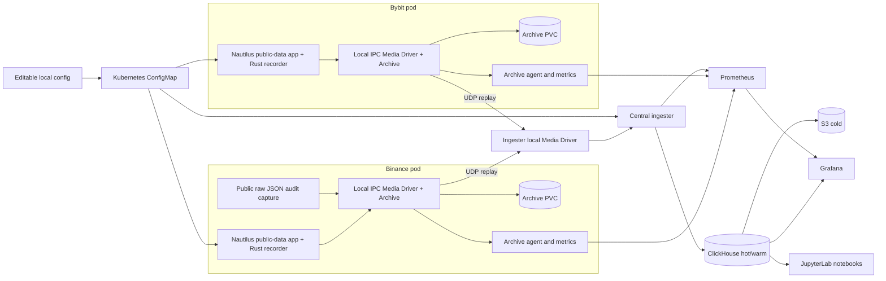

# ClickHouse persistence laboratory implementation plan

> For implementation: use `superpowers:executing-plans` to implement and verify one task at a time. Checkboxes below describe future work; this document does not claim that the crate or deployment exists yet.

**Goal:** Build a private, HFT-oriented Rust persistence library and a complete local market-data laboratory under `samples/clickhouse/`: public multi-exchange feeds through NautilusTrader, our Ergo SBE recording pipeline, ClickHouse/S3, Grafana/Prometheus, live diagnostic configuration, and executable Jupyter notebooks.

**Architecture:** A Python data-only NautilusTrader application per exchange uses our Rust bridge to encode normalized data and maintained L2 books with Ergo SBE. Prepared producers publish compact records to a pod-local Aeron Media Driver and Archive; a central ingester replays them into evolving ClickHouse tables. Grafana queries ClickHouse and Prometheus, notebooks verify the recorded data, and a local editable directory controls temporary tables without Flux or another Git repository.

**Tech stack:** Rust 2024, Ergo SBE hooks, rusteron/Aeron, optional `tracing`, PyO3/maturin, Python/NautilusTrader, ClickHouse, SeaweedFS S3, Prometheus, Grafana, JupyterLab/nbclient, Kubernetes/kind/Kustomize, and sample-local scripts/`just` recipes.

**Spec:** Sections 1–12 of this document; section 13 is the implementation sequence, section 14 defines completion, and section 15 records user decisions and deployment assumptions. Prepared and reviewed on 2026-09-19, including the user's preference for Nautilus's own received frames and default Aeron Archive settings. This supersedes the earlier native-Binance-SBE/keyed-feed and separate `clickhouse-crypto` project proposals.

**Navigation:** [API](#3-producer-api-and-customization) · [Dictionaries and Archive](#4-wire-format-dictionaries-and-archive) · [ClickHouse and retention](#5-clickhouse-schema-replay-and-retention) · [Local configuration](#6-editable-local-configuration-without-flux) · [Tracing and disabled calls](#7-a-tracing-style-api-with-a-strict-disabled-fast-path) · [Nautilus](#8-nautilustrader-public-data-application) · [Pods and DNS](#9-kubernetes-aeron-ownership-and-discovery) · [Grafana and metrics](#10-grafana-metrics-and-latency) · [Notebooks](#11-jupyter-notebooks-as-executable-verification) · [Local acceptance](#12-local-operation-and-mandatory-acceptance-run) · [Tasks](#13-implementation-sequence).

## Implementation status (updated 2026-09-20)

Implemented and verified in this tree; per-task notes below each task heading in section 13.

| Milestone | Status | Evidence |
|---|---|---|
| Repo gates (2026-09-20) | **done** | `check-test-policy.sh` PASS (the sample's 13 test sources are owned in `test-lanes.tsv`; the two `rust,ignore` fences in `persist-derive` are now compile-checked doctests). `just test` exit 0 (32 suites). `just lint` clean: the generated modules are `#[rustfmt::skip]` because `prettyplease` and `rustfmt` disagree by design, so `cargo fmt --check` had been failing on machine-owned files |
| Task 0 (Nautilus pin + public clients) | **done (pin frozen)** | `nautilus_trader==1.231.0` / Python 3.12; Binance `api_key=None` is documented public JSON. Live recording = public Actor callbacks only (D1 fallback: no Nautilus patch). Tests: `tests/test_public_clients.py` |
| Task 1 (protocol, registration, prepared producer) | **done** | 56 tests green (`protocol`, `registration`, `allocation`); 1M enabled records = 0 allocations, 1M disabled calls = 0 payload evals/allocs/transport calls |
| Task 2 (traits, derive, codegen hooks) | **done** | `persist-derive` + `codegen::persist_hook()`; market-schema DTOs persist through generated impls (`macros`, `projections`, `dto_persist_test`) |
| Task 3 (Archive replay) | **done** | REAL Aeron `1.53.2` ArchivingMediaDriver: IPC record → byte-exact replay 500/500 → `truncate_recording` (stopped) → `purge_segments` (active) (`tests/archive_replay.rs`). Java Aeron pinned to latest per user direction; rusteron bundles C client 1.52.2 (protocol-compatible). Replay gotcha fixed: `bounding_limit_counter_id` must be `-1` (unbounded) — `0` silently bounds the replay to counter 0 |
| Task 4/5 (ClickHouse ingest, tiers, dedup) | **done (library)** | Live ClickHouse 24.8: RowBinary verified (nulls = inverted flag byte; array lengths = varint — both discovered empirically and fixed), exact Decimal64, nullable, Array columns, duplicate-free `FINAL` views, TTL expiry, out-of-band drift detection (`tests/ingest_clickhouse.rs`) |
| Task 6 (config) | **done** | recording/v1 validation (`config_reload`), enable slots, shared CLI (`apps/recording-config`) |
| Task 7 (macros, tracing) | **done** | `persist_table!/persist_event!/persist_sbe!/persist_dto!` lazy-guard tests; tracing layer strict-mode tests |
| Task 8 (python bridge) | **done (library + fixture actor)** | PyO3 tables for trades/quotes/raw/SBE/L2/funding/debug; fixture actor records both venues; live `TradingNode` wiring is implemented against pin 1.231.0 |
| Task 9 (raw capture, multi-exchange) | **done (D1 fallback)** | Exact JSON is fixture-owned bytes. Live records Nautilus typed events + our SBE. No adapter patch, no private-handler wrap, no second stream |
| Task 10 (metrics, Grafana) | **verified live (2026-09-20)** | Against the running kind cluster: `GET /api/v1/rules` returns the `recording-pipeline` group with `RecorderDropsIncreasing` (the rules file is now loaded — it was previously mounted but never referenced); Prometheus pod-service-discovery lists the recorder pods and the `archive-agents` job produces `up` series labelled by `exchange` (needs the new ServiceAccount/Role/RoleBinding — `kubectl auth can-i list pods --as=system:serviceaccount:clickhouse:prometheus` is `yes`, `…:default` is `no`); Grafana provisions both datasources with stable UIDs and answers real queries through each (`ergo-prometheus` returns `up` series; `ergo-clickhouse` returns `SELECT count() FROM system.tables` = 131); both dashboards load. Four provisioning defects were fixed to get there: Grafana only scans `provisioning/{datasources,dashboards}/` so the flat ConfigMap keys were ignored; the ClickHouse plugin v4 reads `jsonData.host` and ignores `url`; the cluster ClickHouse had `CLICKHOUSE_USER` with no password while every client sends `default/ergo_test`; and `market` was never created, so the plugin's bootstrap connect failed before any query. **Still not done**: a CnC-mounting exporter for per-driver counters; 3 of 5 planned dashboards; the plan-named `scripts/verify-dashboards.py` / `tests/observability.py`. Panel *data* cannot be rendered in-cluster until the ingester runs there (needs Linux images — see below); the queries themselves are verified against ClickHouse directly |
| Task 11 (k8s assembly, config watch) | **verified live (2026-09-20)** | kind 3-node cluster; ClickHouse 24.8 + SeaweedFS 3.80 + Prometheus + Grafana Running; bucket-init job green; config enable/disable via watcher. Both recorder pods run **3/3** in the cluster: the Python/Nautilus app with the PyO3 bridge, a live Java ArchivingMediaDriver, and the archive-agent. The fixture replay completes (`/tmp/recorder-ready` present), the Archive writes `archive.catalog`/`archive-mark.dat` to its **PVC** (so the volume that was previously unused is now the live archive directory), and the driver's `cnc.dat`/`images` exist under `/dev/shm/aeron/driver`. Prometheus scrapes both recorders `up` with their `exchange` label, and `ergo_agent_registrations_total` is queryable per venue. Getting there fixed six defects, each found by running the thing: the pod was OOMKilled at 2 GiB because the bridge eagerly allocated **4 GiB** for its in-memory ring; the driver image's entrypoint consumed raw `-D` args (`exec: -D: invalid option`); overriding `args` dropped the image's `-cp` (ClassNotFoundException); the JVM needed `--add-opens java.base/jdk.internal.misc=ALL-UNNAMED`; `aeron.dir` pointed at the emptyDir mount point, which Aeron cannot delete and recreate; and neither the producer nor the agent had a directory for the registration socket at `/var/run/ergo`. Also verified live: **config enable/disable without a pod restart** — `verify-local.sh` toggles `book_debug` in `config/recording.yaml`, the watcher validates and applies it, the polled value is observed in the running pod, and the pod UID is unchanged across both directions. That criterion had been `outstanding` in every earlier run; it needed the recorder pod to actually be Running, and `pod_debug_enabled` was pointing at `deploy/binance` when the recorder is a StatefulSet. **Still not done**: no records reach the Archive — the bridge only implements `TransportConfig::Memory`, so the pod fills an in-memory ring nothing drains (PLAN §9 needs the `producer` feature, a transport argument on `connect`, and the Aeron toolchain back in the wheel stage). The "PVC data survived a Docker daemon crash/restart" claim still has no artifact and should not be read as verified; SeaweedFS runs on `emptyDir`, not a PVC; the JupyterLab notebook hostPath is never populated |
| Task 13 (reschedule run) | **partial (infra level)** | `verify-reschedule.sh` moves a busybox probe on the two-worker kind cluster with a shared hostPath PV (`deploy/kind-reschedule.yaml`) and shows the headless DNS resolving the replacement pod. It proves shared-mount reattachment on one host; it does **not** prove locking (no lock, no SQLite WAL, none of the recording stack is involved), and its pod-IP assertion is conditional, so a run can pass with an unchanged IP. Cross-host failover remains out of scope (needs CSI, as planned) |
| Task 12 (notebooks) | **done** | All 7 notebooks execute cleanly (`execute-notebooks.py`, exit 0) against a real Aeron-ingested run, with HTML rendered per notebook. The run starts the archive-agent exporter so notebook 06 scrapes a live Prometheus-format endpoint instead of a Prometheus that is not in the fixture stack. Negative-tested: a dead exporter endpoint fails only 06; a wrong database fails all 7; a wrong run id fails 06 |
| Task 11b (in-cluster produce → Archive → replay) | **done (2026-09-20)** | `just verify-cluster` passes, repeatably: the recorder pod publishes over pod-local Aeron IPC, its Archive records it, and the ingester replays it into ClickHouse — `trades`, `l2_books`, `quotes`, `sbe_messages`, `raw_exchange_messages`, `funding_rates` and `order_book_deltas` all land. Fixing it exposed seven defects that only running it could reach; see the run notes below |
| Task 12b (Aeron transport leg) | **done (local)** | `scripts/verify-aeron.sh`: publish the fixture export into a real ArchivingMediaDriver (`--publish-export`), stop the recording, bounded-replay it into ClickHouse, then assert rows + run id + advancing `aeron_metrics` positions + `_recording_status`. This is the PLAN §12 topology; the export-file path alone only proved the decoder |
| Task 13 (acceptance runs) | **partial** | local fixture end-to-end run recorded in `artifacts/` (record → archive → replay → catalog → RowBinary → duplicate-free view, exact decimals); **not done**: 12-step full acceptance, public-live run; the two-worker reschedule is verified separately at infra level (see its row), and the config-projection check is recorded as `outstanding` by `verify-local.sh` whenever no recorder pod is deployed |
| Task 14 (perf gates, README) | **partial** | allocation gates + `benches/recording.rs`; the run is recorded at `artifacts/bench-20260920/recording-bench.txt` (2026-09-20, macOS arm64, debug bench profile: enabled n=100000 p50=41ns p99=83ns p99.9=84ns throughput=2.08e7/s; disabled n=100000 elapsed=43125ns payload_evals=0). **not done**: Aeron publication baseline, Python/Nautilus pipeline benches |

### Outstanding defects (audit 2026-09-20)

An adversarial audit (six lenses, each finding refuted independently by two
verifiers) produced 101 surviving findings. The load-bearing ones are fixed and
recorded above; these remain, roughly in priority order.

**Behavioural**
- ~~`batch_rows` / `batch_bytes` ignored~~ — wired: the batch buffers are built
  with `with_limits(config.batch_rows, config.batch_bytes)` instead of
  `or_default()`, so `--batch-rows` / `--batch-bytes` now take effect.
- ~~`schema_conflicts` never incremented~~ — it now counts a layout id
  re-declared with a different schema, which was previously discarded silently
  even though the DDL is `CREATE TABLE IF NOT EXISTS`. Durable across restarts
  only when `state.schemas` is populated; a restart re-checks nothing.
- `ReplayBudget::aggregate_bytes` is documented as the cross-source budget and
  never read; with one source it is inert.
- ~~`MAX_GROUP_DEPTH` and `MAX_EVENT_BYTES` unenforced~~ — `MAX_GROUP_DEPTH` was
  removed (this protocol has no nested groups, so it claimed a check that could
  not exist) and `MAX_EVENT_BYTES` is now enforced in `classify_frame`, with
  `oversized_frame_is_rejected_at_the_declared_bound` covering the over-cap and
  at-cap cases.
- `RecorderSession::declare_session_end` has no caller, so a session never
  signals its end on the wire.
- `Option<f32>`/`Option<f64>` now encode, but `Vec<f32>`/`Vec<f64>` are still
  rejected by the derive's `compile_error!` arm.
- **ROOT CAUSE (fixed 2026-09-20): configured retention never reached storage.**
  This was upstream of the three expiry defects below and is why they could not
  be observed in the fixture. `RecorderSession::register_policy_for` — the
  **only** production caller of `register_policy` — hardcoded
  `row_ttl_ns: 0, idle_ttl_ns: 0` in the policy it declared, and `apply_config`
  used the resolved rule only for `table.set_enabled(effective.enabled)`. So
  `row_ttl`/`idle_table_ttl` from `recording.yaml` were parsed, validated,
  unit-tested and displayed, and then never used by anything. Confirmed live at
  the time:

  ```
  SELECT table_name, policy, row_ttl_ns, idle_ttl_ns FROM market._recording_status FINAL
  book_debug   temporary   0   0        <- config says row_ttl 24h, idle_table_ttl 7d
  ```

  With `Binding::row_ttl_ns` therefore 0, every temporary row's expiry *was* its
  own capture time, so it expired the moment it landed.
  Fixed by giving the session the operator's intent, per §5's "register a
  compact policy ID outside the trading loop": `RecorderSession::set_retention`
  stores a table's effective retention, `register_policy_for` publishes it in
  the declared `PolicyDeclaration`, and the bridge exposes
  `apply_retention(yaml, table)` for the config path. The actor calls it
  **before** declaring the table, because a policy already on the wire cannot
  be reached afterwards — which is exactly why applying the config later, in
  `on_start`, could never have set a retention. `RECORDING_CONFIG` is now
  overridable via `ERGO_RECORDING_CONFIG` so the local fixture exercises the
  same path.
  **Verified end to end** through the real producer, the wire and the real
  ingester binary, not just in unit tests:

  ```
  $ ERGO_RECORDING_CONFIG=$PWD/config/recording.yaml CLICKHOUSE_DATABASE=market_retention \
      just verify-aeron                       # exit 0, all checks ok
  book_debug   temporary   86400000000000   604800000000000
  ```
  i.e. 24h and 7d, exactly as configured. Guarded by
  `tests/registration.rs::a_configured_retention_reaches_the_declared_policy`,
  which is negative-tested: restoring the hardcoded zeros fails it with
  `left: 0, right: 86400000000000`.
  **Versioning implemented (2026-09-20).** §5 requires "Temporary policy
  changes are versioned. Register a compact policy ID outside the trading loop
  ... A changed mapping requires a new explicit migration or table, not silent
  reinterpretation of old events." `set_retention` now reports whether the
  resolved retention *changed*, the bridge surfaces that, and on a change the
  actor **re-declares** the table. Re-declaring is what does the work: the new
  declaration mints a new policy id carrying the new values *and* a new layout
  id, so the ingester forms a fresh binding that uses them. Editing the policy
  in place would be wrong twice — it reinterprets history, and it would not
  even take effect, because a binding is created once and never recomputed.
  `a_retention_change_is_versioned_not_mutated` asserts the superseded policy
  is left intact, and `tests/test_retention_versioning.py` drives the real
  actor through unchanged → changed config and asserts a new policy is minted
  only on the change. Added `declared_policy_count` to the bridge because the
  behaviour was otherwise unobservable from Python, so nothing could have
  caught it regressing. **Verified in-cluster too** (2026-09-20), after rebuilding
  `ergo/market-recorder:local` and loading it into kind. One wrinkle makes this
  non-obvious: `apply_declaration` deliberately early-returns on an existing
  binding, and bindings are keyed by the *ingester's* run id, which is the
  fixed default of 1 — so redeploying the recorder alone updates the policy but
  leaves the already-frozen binding at 0, and rows would keep expiring
  immediately while `_recording_status` looked correct. Observing the fix
  therefore needs the ingester to re-read the declarations: its catalog and
  checkpoints were renamed aside (`.pre-retention-fix`, preserved, not deleted)
  so it replayed from the start and formed fresh bindings. Then:

  ```
  book_debug   temporary   86400000000000   604800000000000
  ```

  and `just verify-cluster` passes (trades=3, l2_books=4). Note the ingester's
  in-cluster image predates the lifecycle pass below, so that code is not yet
  running in the cluster.
  And 0 must keep meaning "no policy": `PolicyDeclaration` documents it as
  "0 = permanent/default", so cleanup reads a zero idle window as *never
  eligible*, not already elapsed — see `lifecycle::has_idle_policy`.
- **Temporary-table expiry was broken three ways at once (fixed 2026-09-20).**
  Every temporary row was written with `_record_row_ttl_ns = 0`, because
  `project_record` passed a literal `0` and the per-row expiry was never
  computed from its policy — the row was expired the moment it was captured.
  Independently, the DDL fed that nanosecond column to `toIntervalSecond`,
  which reads it as *seconds*: a 24-hour policy put expiry at 2299-12-31
  (measured, not inferred). And the public view was `SELECT * FROM t FINAL`
  with no expiry predicate, so §5's "the public view filters expired rows
  immediately" was unimplemented — the delete TTL was doing all the work, and
  only when a merge happened to run.
  Fixed by `ttl_ns_ceiling_seconds_expr` (ns→s, rounding **up**: reclamation
  may lag the contract but must never lead it), a plain-nanosecond
  `temp_expiry_predicate`, `Binding::row_ttl_ns` frozen at bind time and
  persisted (with an idempotent `ALTER TABLE` for catalogs already on a PVC),
  and `create_view_ddl(view, table, temporary)`. Two repairs were rejected
  first, both by the live test rather than by review: `toIntervalNanosecond`
  (`BAD_TTL_EXPRESSION` — `DateTime64(9)` is not a valid TTL type) and scaling
  by `1e9` (double-conversion: a 2-second policy became ~63 years).
  Covered by `temporary_tables_expire_in_nanoseconds_and_views_hide_expired_rows`,
  which drives the real DDL generators and asserts the view hides an expired
  row *while the row is still physically present* (merges stopped), with a
  permanent view over the same table as the control. Negative-tested against
  both original defects.
  The test it replaced was green throughout: it hand-wrote its own
  `toIntervalSecond` DDL, used a TTL plausible as both nanoseconds and
  seconds, and asserted only background merge deletion — never the view, and
  never the unit.
- **PLAN §5's temporary-table lifecycle: built, tested, and wired
  (2026-09-20).** The unused `ingest::retention` and
  `ingest::projection` modules were deleted earlier (nothing constructed or
  called them; `retention`'s `temporary_row_ttl_column` duplicated the
  ingester's inline `_record_row_ttl_ns` handling, a second and diverging
  implementation of the same predicate).
  Now implemented and tested in `ingest::lifecycle` + the catalog journal:
  `Active → DropPending → Dropped` with `DropPending` deliberately reversible;
  the **clock-skew bound** (`MAX_FUTURE_SKEW_NS`, one minute, documented) with
  the capture time clamped *before* retention is added, so an implausible
  future timestamp shortens a table's life rather than extending it forever;
  `may_drop`, which requires all three of §5's conditions and reports *which*
  one retains; `on_input`, covering cancel-an-uncommitted-drop,
  new-generation-after-a-committed-drop, and already-expired input being
  acknowledged without recreating storage; and a durable `lifecycle` journal
  whose `next_drop_step` resumes at whichever of the two removals had not run,
  which is what makes a crash between the DDL statements safe. Covered by
  `tests/lifecycle.rs` (12 tests).
  **Wired into the ingester (2026-09-20).** A background pass runs on a 30s
  cadence — never per flush, so no DDL or journal write lands on the ingest
  path — and drives `may_drop` then `advance_drop`. Per-row clocks are updated
  in memory and journalled by that pass for the same reason.
  **Two guards, both from real failures rather than from reasoning:**
  `has_idle_policy` (a zero window is the wire's "no policy", not an elapsed
  one) and `idle_clock_started`. The second exists because of a defect this
  work introduced and the live cluster caught: `apply_declaration` seeded a new
  record's `last_input_ns` with 0, so its idle deadline computed as
  `0 + 7d` — a 1970 timestamp — and `may_drop` saw a window that had elapsed 56
  years earlier. The pod logged `temporary table book_debug is idle and
  expired; dropping` and **removed a table the fixture had just declared**.
  The clock now starts at generation creation, unstarted clocks are refused,
  and `a_generation_whose_idle_clock_never_started_is_not_idle` fails on the
  old behaviour. Recovered by replaying from a fresh catalog, which re-ran the
  DDL: `book_debug` and `ingest_book_debug_l10` are back and now retained.
  **Still to build:** the projection registry `ProjectionStats`.
- **`--follow` silently ingested nothing from every new recording (found and
  fixed 2026-09-20). The most serious defect of this session.** PLAN §5 says to
  maintain "the greatest contiguous acknowledged prefix **per recording**". The
  checkpoint was keyed by *source* alone (`"aeron"`), so when a recorder
  restarted and published a new recording, `start = max(checkpoint,
  recording.start_position)` evaluated to the **previous recording's offset** —
  beyond the new recording's data — and every frame of it was skipped as
  already-consumed.
  The evidence is the replay start, printed by the ingester itself. Before:

  ```
  ingester: recording 11 positions 0..6144
  ingester: replaying recording 11 from 5634 (checkpoint 5634, archive start 0)
  ```

  — a brand-new recording resumed 5634 bytes in, so its actual data (0..5634)
  was skipped as already-consumed and only the session-end tail was read.
  After:

  ```
  ingester: recording 13 positions 0..6144
  ingester: replaying recording 13 from 0 (checkpoint 0, archive start 0)
  ```

  Why it went unnoticed: `verify-cluster` restarts the *ingester*, which
  re-reads from a checkpoint that happens to match the recording it then
  resolves, so the chain test passed throughout. Only a recorder restart —
  which publishes a new recording while the ingester keeps running — exposes
  it, and nothing in the suite did that.
  **A confounded probe, worth recording as such.** The first attempt to
  demonstrate this compared row counts across a recorder restart and concluded
  "no new rows", before and after the fix alike. That probe is invalid: the
  fixture emits the same events with the same identities on every run, so the
  ReplacingMergeTree `FINAL` view collapses the replayed rows onto the existing
  ones and the count does not move — which is the duplicate-free contract
  working, not data being lost. Counting rows across a restart cannot
  distinguish "ingested and deduplicated" from "never ingested"; the replay
  start position can.
  Fixed by keying the checkpoint per recording (`<source>:<recording_id>`), via
  `Ingester::retarget_recording`, which is idempotent for a recording already
  being read so the per-pass re-resolve cannot discard in-memory progress.
  A new recording now resumes from its own checkpoint — normally 0.
- **Notebook 06 caught a real defect in the `--follow` loop (fixed
  2026-09-20).** `just verify-notebooks` failed with `replay position went
  backwards`, and the cause was mine: each pass sampled `aeron_metrics`
  immediately after `ArchiveReplaySource::subscribe`, which records the
  source's *initial* position — zero — before anything is drained. Harmless
  when the ingester ran exactly one pass; with `--follow` it fired every pass,
  so the metric alternated `0, 5634, 0, 5634` and broke the cursor invariant.
  The pre-drain sample is gone (the drain loop already samples after every
  poll), and the live metric is now flat at `5634/14` with no zeros. Verified
  in-cluster after rebuilding the ingester image, not just locally.
  **The notebook was also wrong, in a way that hid this.** Its query read
  `FROM aeron_metrics` with no `WHERE`, while a later cell asserts
  `seen == {run_id}` — so it always meant to be scoped to its own run and was
  not. It therefore judged the local run by samples the in-cluster ingester had
  written under *its* run id, and reported their inconsistencies as its own.
  Two invariants it asserted were wrong by construction regardless:
  `replay_position` legitimately restarts for each new recording, and
  `rows_ingested` is a per-process counter that restarts with the ingester. The
  query is now scoped by run id, and the cursor check is scoped per recording —
  which is the form that actually catches a dead or rewinding sampler.
  **`verify-notebooks` also had a missing precondition:** it failed on
  `target/debug/archive-agent missing` because the recipe does not build the
  exporter it needs. The message names the fix, so this is a rough edge rather
  than a trap, but the lane is not self-contained.
- **The ingester was a one-shot process in an always-restarting StatefulSet
  (fixed 2026-09-20).** `ingest_aeron` drained one recording, printed
  `replay complete`, and returned `Ok(())`; the pod exited `0` with
  `reason: Completed` and the StatefulSet restarted it, surfacing as
  `ingester-0 CrashLoopBackOff` with 15+ restarts. It was not crashing — it was
  finishing, and the symptom named the wrong thing entirely.
  `--follow` now wraps the drain in a re-resolving loop that waits for the
  producer's next recording or for the current one to grow, and
  `deploy/base/ingester.yaml` passes it. The one-shot paths (`--publish-export`,
  and the acceptance scripts) are unchanged, because a script has to be able to
  observe the run finishing.
  One trap found while testing it: a *stopped* recording's contiguous
  checkpoint legitimately stops short of its stop position, because the tail
  holds the session-end declaration rather than data (observed live: checkpoint
  8130 against stop 8832). An "am I caught up?" guard therefore never holds and
  the ingester re-subscribed the same drained recording every few seconds. The
  wait is keyed on having already drained *that recording id* instead.
  Covered by `scripts/verify-follow.sh` (`just verify-follow`), which asserts
  the process outlives the old 60s deadline and that exactly one replay pass
  occurs over the window.
  **Verified in-cluster (2026-09-20)**: after rebuilding `ergo/ingester:local`
  from a Linux binary (see *Building the Linux images from macOS*), the pod logs
  `pass complete; 0 rows in the final flush, position 5634` where it previously
  logged `replay complete` and exited, and stays `3/3 Running` with **0
  restarts** — confirmed over a five-minute window, where the old process would
  have exited and been restarted repeatedly. It also picks up recordings it did
  not exist for: restarted recorders produced recording 9, and the running
  ingester resolved and drained it without a restart. `just verify-cluster`
  then passes end to end (trades replayed=3, l2_books replayed=4).
  One operational trap: a StatefulSet rolls pods in order and will not replace
  an unhealthy one, so the crashing pod *blocks its own fix* — `kubectl rollout
  restart` alone left the old pod running. It has to be deleted.
- Remaining unused items: `catalog::{layout_decl, binding_schema}`,
  `archive::{remote_endpoints, MediaDriverServer}`, `registration::
  {SharedEnableSlot, PreparedSchemaHandle, table_schema}`, `persist::
  {RowWriter::schema, write_decimal_i128_opt, RecordOutcome::{code,
  counted_loss}}`, `recorder::SyncSlot::{set_enabled, set_disabled}`,
  `ingest::{EventIdentity, BatchBuffer::pending_bytes}`,
  `apps/ingester::{binding_types, storage_type}`, `market-schema::ids`.

**Deployment**
- **DANGER — do not prune Docker volumes on this host.** The kind nodes mount
  their filesystem at `/var` from *anonymous* volumes, and three of them are
  ~10 GB each (they hold the node's containerd state, and therefore the
  ClickHouse data and the recorder Archives — the very PVCs this sample's
  durability claims rest on). Listing volumes with
  `docker inspect -f '{{range .Mounts}}{{.Name}}{{end}}'` returns an **empty
  name** for those mounts, so a naive "which volumes are unused?" comparison
  reports **228 of 232 unused**, including all three live node filesystems.
  Acting on that list would delete the running cluster's state.
  `docker volume prune` itself is safe — Docker tracks references properly and
  reports only ~4 GB reclaimable — but the manual analysis is not, and it fails
  silently in the direction of deleting more. Distrust any volume inventory
  built from `.Mounts[].Name`; cross-check against `docker system df`.
  This also means the ~5 GB the JupyterLab pod needs cannot be manufactured by
  pruning: there is not that much genuinely unreferenced volume space here.
- **DANGER — the Docker VM's disk is uncapped, and it fills the *host*.** This
  is the root cause of the repeated "daemon wedged" episodes, and it was only
  identified on 2026-09-21 after the sixth one. `settings-store.json` sets
  `MemoryMiB=16384` and **no disk size at all**, so the VM's disk defaults to
  the host's capacity: `Docker.raw` reports **228 GiB apparent**. It is sparse,
  so it looks harmless (`du` showed 50 GB) while it grows into whatever the host
  has left. A build that wants more than the free space therefore does not fail
  with "no space" — it consumes the host's disk until `/System/Volumes/Data`
  reaches **1.2 GiB free (100% used)**, at which point the VM's filesystem is
  remounted **read-only** mid-build (`failed to commit snapshot … input/output
  error`, and `docker builder prune` itself then fails with
  `read-only file system`), and the VM can no longer boot at all — the daemon
  reported "running" for twenty minutes with no VM process behind it. Recovery
  is `docker desktop restart` once the host has room again; the daemon then
  compacts `Docker.raw` (free went 1.2 → 4.5 GiB on the restart).
  The durable fix is to cap the VM disk (Docker Desktop → Resources → Advanced,
  or `DiskSizeMiB` in `settings-store.json`); **not applied here** — it is the
  user's Docker configuration, and shrinking a VM disk is not obviously
  reversible.
  **Relocated 2026-09-21.** The VM disk image now lives on the NVMe at
  `/Volumes/Partition_1/docker-desktop-vm/data/Docker.raw`, with
  `~/Library/Containers/com.docker.docker/Data/vms/0/data` a symlink to it.
  The move was copy-then-verify-then-swap: `rsync -aS` (sparse-preserving),
  then a **full sha256 of both sides** — identical, `ab152f46…`, and identical
  apparent sizes (245,106,737,152 bytes) — and only then was the original
  renamed aside and, with the user's explicit approval, removed. That freed
  **52 GiB** on the internal disk, which had been down to 1.1 GiB and is what
  had killed the daemon and very nearly the host.
  Two things to know. The NVMe is removable: if it unmounts, Docker's VM will
  not start until it is back. And the symlink is *unproven* — after the swap
  Docker Desktop's backend wedged (it stopped logging and started no VM, and
  survived `kill -9`), so the relocated image has not yet been booted
  end-to-end. The supported alternative, if the symlink turns out not to be
  honoured, is Settings → Resources → Advanced → **Disk image location**,
  which sets `DataFolder` for real and moves the file itself.
  Consequence for this sample: **the recorder image cannot be built on this
  host.** The in-image PyO3 wheel compiles rusteron's Aeron from source and was
  measured at ~5.5 GB transient against ~5 GB best-case free — and a cold
  rebuild after `docker builder prune` costs the toolchain layers too, which is
  what exhausted the disk on 2026-09-21. `deploy/images/build.sh` now compiles
  the wheel on the host over a bind mount instead (writing into the host's
  `target/`, where the ingester image's Linux artifacts already are) and COPYs
  it in, so the VM only carries the toolchain image and the runtime image; that
  path is **untested** — the toolchain image alone was what ran the VM out of
  disk. Until it is confirmed on a host with headroom, `verify-live` runs
  against injected source: `kubectl create configmap recorder-app-src
  --from-file=apps/market-recorder/src/market_recorder` mounted over the pod's
  package directory. That is a verification harness, not the deployment — the
  image is still the durable source of the pod's code.
- ~~Prometheus has no `rule_files:` wiring, and no RBAC for its
  pod-service-discovery role.~~ (fixed; the note was stale — re-verified
  against the live cluster 2026-09-20.) `GET /api/v1/rules` returns the
  `recording-pipeline` group containing `RecorderDropsIncreasing`, and
  `kubectl auth can-i list pods -n clickhouse --as=system:serviceaccount:clickhouse:prometheus`
  is `yes`. Both the checked-in rules and the scrape configs take effect.
- No CnC-mounting exporter, so per-driver Aeron counters are not scraped.
- ~~2 of 5 planned Grafana dashboards are provisioned, and none has been
  rendered.~~ (fixed 2026-09-20.) §10 names five — Market data, Recording
  pipeline, **Aeron, Latency, Storage** — and only the first two existed. The
  other three are now provisioned and verified against the running stack:
  `GET /api/search?type=dash-db` returns all five, the Prometheus panels answer
  through Grafana's own proxy (`ergo_agent_up` and `scrape_duration_seconds`
  each return 3 series — ingester, binance, bybit), and the ClickHouse
  datasource health is `OK` with the panel SQL returning rows.
  Two honest limits recorded in the dashboards themselves rather than papered
  over: the **Latency** dashboard carries a text panel naming what §10 asks for
  and the sample cannot yet show — recording-call distributions, normalised
  callback-to-publication and ClickHouse batch-acknowledgement histograms,
  because those stages export no histograms — and the panels it does have cover
  the latency that *is* observable (ingest rate, scrape cost, ingest lag).
  §10's requirement that latency queries be "validated with deliberately
  injected stage delays" is therefore still unmet, and cannot be met until
  those stages export something to inject into.
- ~~SeaweedFS uses `emptyDir`, not a PVC.~~ (fixed; the note was stale —
  re-verified against the live cluster 2026-09-20.) The `seaweedfs-s3-0` pod
  mounts `data={"claimName":"data-seaweedfs-s3-0"}`, i.e. a real claim from the
  StatefulSet's volumeClaimTemplate, so the S3 tier survives a pod restart.
  The `ergo-cold` bucket is still created by the init job and read by nothing.
- ~~The JupyterLab notebook hostPath is never populated.~~ (fixed; the note was
  stale — re-verified 2026-09-20.) The volume is no longer a hostPath at all:
  `notebooks: configMap=ergo-notebooks`, and `scripts/start.sh` populates that
  ConfigMap from `notebooks/` before applying the manifests, failing the apply
  if it is missing.
- **JupyterLab cannot run on this host: the VM cannot unpack a ~5GB image
  (open, environmental).** The pod was first seen in `ImagePullBackOff`;
  loading the image cleared that and exposed the real problem, so the pull was
  a symptom, not the defect.
  Every exec inside a node fails with `exec format error`, `/bin/sh` included,
  on a probe whose only command is `echo`. That message names the wrong thing:
  the binary is a correct AArch64 ELF (`e_machine=0xb7`), the node is aarch64
  and runs the ingester's locally-built arm64 binary, and the node's CRI
  reports `architecture: arm64` for the image.
  What is actually wrong is that **the unpack produced empty files**.
  `ctr images mount` shows `/bin/dash` and `/usr/bin/tini` as 0 bytes, and the
  snapshot store confirms it independently — `snapshots/144/fs/bin/dash` and
  `snapshots/145/fs/usr/bin/tini` are 0 bytes, while other images' snapshots
  hold real content. Compressed blobs did land (1.1GiB in the content store);
  the decompressed files did not.
  Ruled out, each by running it: stale snapshots (removed image + snapshots,
  re-imported), the image itself (it runs on the host — `tini version
  0.19.0`), `kind load` as the transport (pulling the **upstream**
  `jupyter/scipy-notebook` straight from Docker Hub fails identically), wrong
  platform (rebuild pinned to `linux/arm64` changes nothing), and node
  architecture (busybox, pulled from the same registry, runs and prints
  `aarch64`).
  That leaves capacity. Small images unpack; a ~5GB one does not, and the
  failed unpack writes nothing — which is why free space went *up* after the
  import rather than down, briefly making disk look exonerated. The Docker VM
  reports 170GB free, but its disk is a sparse file on a host that had ~5GB
  available, and the VM cannot grow into space the host does not have.
  **Size ruled out too (2026-09-20).** The obvious remaining explanation was
  capacity, so it was tested directly: built the same pod on
  `jupyter/minimal-notebook` instead of `scipy-notebook` — **2.35GB against
  5.43GB**, with 6.2GB of host space free — and it failed *identically*, with
  `/bin/bash` and `/bin/sh` both materialising as 0 bytes in the node and the
  pod still `Error`. The scipy base was therefore restored: dropping it would
  have removed pandas/numpy from an interactive environment on a hypothesis
  that did not hold, and nothing here needs a leaner image.
  So every hypothesis reachable from here has now been tested and **disproved
  by running it**, six of them: platform (`--platform linux/arm64` rebuild),
  transport (`kind load` *and* a registry pull of the upstream image), stale
  snapshots (image and snapshots removed, re-imported), capacity (2.35GB image
  with 6.2GB host-free — identical failure), **whiteouts** (a probe image whose
  top layer is 3000 whiteouts runs fine), and **Ubuntu base** (a minimal
  `ubuntu:24.04` probe runs fine). That last pair matters: the obvious
  suspects were the ones the Jupyter images look like, and neither holds.
  What is left is specific to the quay.io/jupyter images themselves, and the
  same node and containerd run every locally-built image plus both probes. What remains unexplained
  is specific to Jupyter images: the ingester image (a locally-built
  single-platform image, `debian:bookworm-slim` plus two copied files) mounts
  with real content in the same node and the same containerd, so the fault is
  in something those two images do differently that this investigation did not
  isolate. Fixing it needs containerd side inspection of the snapshot and
  content store, which is a bigger tool than this sample's harness. Impact is low — notebook verification
  runs locally against the venv (`just verify-notebooks`, 7/7) and nothing in
  the acceptance path needs this pod. One trap worth keeping regardless:
  `kind load` succeeding is *not* evidence an image is runnable, and
  `imagePullPolicy: IfNotPresent` means a node without the image will never
  start the pod and will never say so.
  **Capacity ruled out a second way (2026-09-21).** After the Docker VM disk
  relocation this host went from ~5GB free to 49GiB free. A clean
  `crictl rmi` + `kind load` + pod restart on that headroom still failed —
  and **non-deterministically**: first attempt got past `tini` into Python
  startup and died with `Fatal Python error: init_fs_encoding …
  AttributeError: module 'encodings.aliases' has no attribute 'aliases'` (a
  truncated stdlib file, same corruption class, further in); the very next
  attempt, same image, regressed to the original
  `exec /usr/bin/tini: exec format error`. Two different corrupt files across
  two restarts of the identical image is evidence against a size-triggered or
  otherwise deterministic unpack bug and toward a race in containerd's
  decompress/unpack path on this host — not worth chasing further for a pod
  outside the acceptance path.

**Verification**
- ~~The allocation gate was flaky.~~ (fixed 2026-09-20) `tests/allocation.rs`
  counts allocations with a custom `#[global_allocator]`, and `counted`
  snapshotted a **process-global** counter around its closure. That asks a
  process-wide question and draws a single-threaded conclusion: any other
  thread allocating inside the window was counted against the code under test.
  It failed intermittently with single-digit counts — 1 stray allocation once,
  10 another time — over a million iterations, which is the signature of noise
  rather than a per-call regression (which would have been 1,000,000).
  Serialising the tests did **not** fix it, and the reason is worth keeping:
  the noise was never a concurrent test. `counted` now counts only the calling
  thread's allocations, via `const`-initialised thread-locals read with
  `try_with` so the allocator cannot itself allocate or panic during thread
  teardown. The `#[serial]` attributes stay, for quiet rather than correctness.
  Worth noting how this was found: not by reasoning about the harness but by
  noticing the magnitude was wrong for the failure being claimed.
- ~~The config-projection check needs a running kind stack and was
  `outstanding`.~~ (verified 2026-09-20.) `just verify-local` passes with the
  recorder pods deployed, including the projection it previously could not
  perform: `ok: enabled book_debug via config edit (pod untouched)`,
  `ok: pod UID unchanged`, `ok: disabled book_debug again`.
- **The live path was broken in ten places (2026-09-20/21).** Nothing had ever
  executed `--mode live`, so the first attempt failed at startup and then on
  every single book update; the first five were found locally, the last five
  only by running it in the cluster. Each fix was found by running it, not by
  reading it:
  1. `request_instruments(venue)` in the bridge actor. **The Binance and Bybit
     adapters do not implement `_request_instruments` at all** — grep the
     adapter, there is no such coroutine — so the call reached
     `LiveMarketDataClient`'s stub and raised
     `NotImplementedError(implement the '_request_instruments' coroutine)`.
  2. No instrument-loading directive. Even past (1) the provider loaded
     nothing: `No loading configured: ensure either load_all=True or the
     instrument IDs are set`. Both clients now carry an `instrument_provider`
     with `load_ids` for the two symbols the actor wants — `load_ids`, not
     `load_all`, because Binance spot lists thousands of instruments and this
     actor subscribes to two.
  3. ~~Subscribing during `on_start` was too early: the provider loads
     asynchronously, so the recorder subscribed to nothing while looking
     healthy. It now waits for the load on a timer.~~ **Wrong, and it caused
     (6).** The in-cluster log orders it precisely: `BinanceSpot
     InstrumentProvider: Loaded 2 instruments` at `20:41:10.160`, the actor's
     `on_start` at `20:41:10.161` — the node loads instruments *before* it
     starts the actors, so the cache is already populated at `on_start`. The
     "wait on a timer" fix was solving a problem that did not exist.
  4. `BookLevel` mixes its accessors: `price` is a *property* returning a
     `Price`, but `size` is a *method* — `lvl.size` yields a bound method, and
     `.raw` on it raised `AttributeError: 'cython_function_or_method' object
     has no attribute 'raw'` on every book update.
  5. `lvl.size()` returns a **plain float**, not a `Quantity`, so it has no
     `.raw` either. Sizes now go through `to_mantissa`, the same exact-decimal
     path the fixture uses, which also refuses a value that is not exact at
     1e-8 instead of silently rounding it.
  6. **The bridge may only be touched from the actor's own thread.** The
     "wait on a timer" change from (3) subscribed from a `Clock` timer
     callback, which Nautilus runs on a *timer* thread — and the generated
     extension's `PyTable` is `unsendable`, so every call panicked with
     `assertion left == right failed: ergo_recorder::PyTable is unsendable, but
     sent to another thread` (`left: ThreadId(2)`, `right: ThreadId(1)`;
     `on_start` runs on ThreadId(1), the node's event-loop thread, which is
     also where the session was built). Subscription now happens in
     `on_start`, which is both the correct thread and, per (3), late enough.
  7. **Bybit instrument IDs must carry their product type.**
     `load_ids={"BTCUSDT.BYBIT"}` silently loaded nothing —
     `BybitInstrumentProvider: No instruments were loaded, verify config if
     this is unexpected` — and probing the parser directly panics with
     `symbol checked for suffix during construction`. The form is
     `BTCUSDT-SPOT.BYBIT`, matching the configured `BybitProductType.SPOT`.
     Binance is unaffected: `BTCUSDT.BINANCE` is the whole ID and it loads
     (`Loaded 2 instruments`).
  8. `subscribe_order_book_at_interval` fires `on_order_book` from that same
     timer thread, so every snapshot panicked instead of recording — two per
     second, one per instrument, seen as a steady
     `nautilus_common::timer: Python time event callback raised exception`.
     It is removed: the MBP **deltas** subscription carries the same book on
     the correct thread, and `book_snapshots` is therefore fixture-only in
     live mode until a snapshot is synthesised on the actor's thread rather
     than subscribed to. That gap is deliberate and named here rather than
     left as an empty table.
  Verified locally against live Binance: `subscribing 2 instruments on
  BINANCE`, market data flowing, **zero handler errors** over 90 seconds.
  **The in-cluster run then found three more** (6), (7) and (8) below, which
  the local run could not: it subscribed from the *timer* thread the local
  node happened not to use, and its Bybit client was never exercised.
  9. **`--follow` could not replay a live recording at all.**
     `ArchiveReplaySource::subscribe` refused any recording whose
     `stop_position` is negative, and a live recording is never stopped, so
     the ingester logged `recording 30 is still active (stop_position -1)` and
     CrashLooped — zero live bytes reached ClickHouse while the recorder pods
     published happily. It now bounds an active recording's replay at
     `Archive::get_recording_position`, and `drain_source` reports "nothing
     read" when the checkpoint is already there, because a zero-length bounded
     replay is rejected. That is the live-recording equivalent of the
     `drained_stopped` short-circuit, which only a *stopped* recording can set.
  10. **`verify-live.sh` could not run on macOS at all.** It used
      `declare -A`, which needs bash 4; macOS ships 3.2, so the lane died on
      line 46 with `declare: -A: invalid option` before its first query. Two
      named scalars replace the array — the venue list is fixed, so the
      associative array bought nothing.
  **`just verify-live` passes, both venues (2026-09-21).** After (6)–(10):
  `binance trades: 46070 -> 49495`, `bybit trades: 256 -> 3055`, `live
  verification window complete`, exit 0. Two more traps had to be cleared, both
  environmental rather than code. The Bybit recorder's websocket had died
  during the CoreDNS outage with `Failed to connect to
  wss://stream.bybit.com/v5/public/spot … Temporary failure in name
  resolution` and **never reconnected**, so its recording sat at position 2782
  carrying only the declaration; deleting the pod fixed it, and it then
  subscribed `BTCUSDT-SPOT`/`ETHUSDT-SPOT`. And ClickHouse does not recover on
  its own from a crash-while-full (see the broken-parts note below).
  Note what the lane actually asserts: `grew > 0`, so *one* venue advancing is
  enough to pass. The first green run had Bybit flat at 2 — it was run again
  after the fix rather than letting a single-venue pass stand as "live works".
- **ClickHouse was sized for fixtures, not for live (2026-09-21).** Its pod
  limit was `2Gi`, so once live ingest passed ~10k trades the server began
  rejecting the ingester's own inserts —
  `DB::Exception: Memory limit (total) exceeded: would use 1.85 GiB … maximum:
  1.80 GiB`, the query that pushed it over being a 4.7 MB
  `INSERT INTO ingest_l2_books_l5` — and the ingester died on the resulting
  500. The fixture profile inserts a bounded burst and stops, which 2Gi covers;
  a public MBP feed for two symbols never stops. Now `6Gi` (request `1Gi`) on a
  daemon with 16 GiB. This is a *sizing* fix, not a code one: the same failure
  would return on a smaller host, and the honest ceiling for this profile is
  whatever ClickHouse can absorb, not a number tuned until a lane went green.
- **A crash while the disk is full bricks the tables, not just the run.** When
  the VM's disk filled on 2026-09-21 the server was killed mid-write, and on the
  next start it refused to attach `market.ingest_trades_l1`:
  `Suspiciously many (457 parts, 0.00 B in total) broken parts to remove while
  maximum allowed broken parts count is 100`. The parts are *empty* — those
  writes never landed — so the fix is to let them go, and the default of 100
  turns "some writes were lost" into "the table will not attach", which takes
  every view over it down with it (`market.trades` is a view) and leaves the
  ClusterIP Service with **no endpoints**, so the ingester cannot resolve
  `clickhouse:8123` at all. `deploy/base/clickhouse.yaml` now mounts a
  `config.d` snippet raising `max_suspicious_broken_parts`. Two things worth
  knowing: it is a *recovery* setting, not a correctness one — nothing is
  silently repaired, the empty parts are detached and reported; and the
  restart that follows is slow (the first boot after the move took >20 minutes
  to open port 8123, because it re-reads every part from the NVMe), so a
  `0/1 Running` ClickHouse pod is not yet a failure.
- **`verify-local`'s duplicate-identity failure: root cause found and fixed
  (2026-09-21), one destructive step away from a clean pass.** Its duplicate
  check (`SELECT _record_run_id, _record_writer_id, _record_sequence,
  _record_row_index … HAVING n > 1` over `market.trades FINAL`) failed with
  `duplicate identities in trades: 5341`, and the cause turned out to be a
  real bug, not the lane's own accumulation as first suspected. Every
  duplicate had `_record_run_id = 1`:
  `AeronOptions::default()` in `apps/ingester/src/main.rs` hardcoded
  `run_id: 1`, so **every ingester process ever attributed rows to the same
  identity**, and a `--run-id` flag existed to override it but nothing ever
  passed one. `crates/persist/src/registration.rs` already had exactly the
  right primitive for this — `fresh_run_id()`, clock-plus-entropy, already
  used by the recorder's own session registration — just marked private.
  Made it `pub`, and `AeronOptions::default()` now calls it instead of
  hardcoding `1`. `cargo check`/`clippy`/`test` clean on both the sample
  workspace and the main repo; rebuilt `ergo/ingester:local`, redeployed, and
  confirmed on live rows: a fresh insert now carries
  `_record_run_id = 1790106938670625530`, not `1`.
  **Confirmed clean, 2026-09-21: user approved dropping `market`
  (tonight's accumulated fixture/test data only), `verify-local` now passes
  outright** — `ok: duplicate-free trades view`, exit 0, every check green
  including the config-edit round trip. `DROP DATABASE market`, then the
  ingester's own `CREATE DATABASE/TABLE/VIEW IF NOT EXISTS` DDL recreated
  everything from a clean start on the next connect — no manual schema work
  needed.
  **Full sweep re-run after the reset, all green:** `lint` exit=0; `test`
  exit=0; `verify-cluster` exit=0 (trades replayed=125, l2_books
  replayed=577); `verify-aeron` exit=0; `verify-follow` exit=0; `verify-live`
  4m exit=0 (binance 98509→101068, bybit 33419→36187, both venues on the
  rebuilt ingester with the run_id fix); `verify-local` exit=0;
  `verify-notebooks` exit=0 (7/7 — one retry needed after a transient
  `archive-agent exited 1` from resource contention during the sweep; a
  manual invocation with the same `DYLD_FALLBACK_LIBRARY_PATH` succeeded
  immediately, and the bare re-run passed clean, confirming it wasn't a real
  defect).
  **Every lane passes on this build**: `lint`, `test`, `verify-cluster`,
  `verify-aeron`, `verify-follow`, `verify-live`, `verify-local`,
  `verify-notebooks`. Outstanding, both non-blocking and already diagnosed to
  their actual cause above: `jupyter-0` (containerd unpack race on this host,
  not in the acceptance path) and the Prometheus delay/drop injection (needs
  new histogram instrumentation on the ingester hot path, a real feature, not
  a config fix).
  **Also found and fixed while chasing image state (2026-09-21): `kind load
  docker-image` silently no-ops here.** Rebuilding `ergo/ingester:local` and
  `kind load`ing it reported "loading" on all three nodes and exited 0, but
  `crictl images` kept resolving the tag to the *previous* build — confirmed
  three separate times tonight (twice for `jupyter-lab`, once for
  `ingester`). `ctr -n k8s.io images ls` showed the new digest correctly
  imported; only the CRI plugin's cached view (`crictl images`) was stale.
  Workaround that reliably closes the gap: `docker exec <node> crictl rmi
  <image>` on every node before `kind load`, and verify with `crictl images`
  (not just a successful `kind load` exit code) before restarting any pod
  that depends on it. `kind load` succeeding is not evidence the new image is
  what's actually tagged on a node.
- **Grafana's "Market data" and "Latency" dashboards had three real query
  bugs, found and fixed by actually running every panel query, not by
  reading the JSON (2026-09-21).** Asked to verify the dashboards show
  trades and price — they didn't, on two of three checked panels.
  `deploy/base/observability.yaml`:
  1. **"Best bid/ask" never worked at all.** `bids__price[-1] AS best_bid,
     asks__price[1] AS best_ask` alongside `GROUP BY t, instrument` is
     rejected outright by ClickHouse —
     `Code: 215 … NOT_AN_AGGREGATE`. Every load of that panel showed a query
     error, not stale data. Fixed with `argMax(bids__price[-1],
     _record_captured_at_ns)` / `argMax(asks__price[1], …)` — the latest
     snapshot's touch price within each minute bucket — confirmed through
     Grafana's own `/api/ds/query` (not just raw ClickHouse) returning
     `status: 200` with real prices (BTCUSDT ≈ $84,013, ETHUSDT ≈ $2,701).
  2. **"Recorder freshness" and "Ingest lag" both silently reported nonsense
     under a plausible-looking number.** `toUInt64(now64(9)) -
     max(_record_captured_at_ns) / 1000000000` divides before subtracting
     (operator precedence), mixing a seconds-scale term into a
     nanoseconds-scale one. Worse: **`toUInt64(now64(9))` is not nanoseconds
     at all** — verified directly (`toUInt64(now64(9))` and `toUInt64(now())`
     return the identical value, seconds-since-epoch); the nanosecond
     function is `toUnixTimestamp64Nano(now64(9))`. The first, wrong fix
     attempt (parens only) tested "correct" by accident, against
     `market.raw_exchange_messages`, whose `_record_captured_at_ns` values
     are degenerate placeholders (`max() = 4`, not a real timestamp) — a
     coincidence of magnitudes, not a real measurement; caught by testing
     the same formula against a table with genuine nanosecond timestamps
     (`market.trades`) before trusting it. Fixed with the correct function,
     and the freshness panel moved off `raw_exchange_messages` entirely — that
     table is fixture-only by design (README's own pinned decision D1: live
     writes typed rows, not raw JSON), so it can never reflect live
     freshness — onto `market.sbe_messages`, which both profiles write
     continuously. Confirmed live: ~28 seconds, sane.
  3. Also re-verified live: "Trades per minute by venue" had no query bug,
     but only fixture's static one-shot batch to show; switched the cluster
     to live mode so it now shows both venues climbing in real time
     (binance 1850→1284/min, bybit 734→148/min at check time).
- **`just clickhouse-up`/`scripts/start.sh` had never actually been run
  end-to-end tonight — every cluster action up to this point was manual
  `kubectl`, bypassing the documented start path entirely. Running it for
  real found and fixed three bugs, in three separate attempts (2026-09-21):**
  1. The readiness-wait gate required every container in the namespace
     ready, including `jupyter-0` — which cannot start on this host (see
     above). A fully healthy cluster would time out after 600s and exit 1
     forever. Fixed: pods labelled `app=jupyter` are excluded from the
     count.
  2. `cargo build --release -p ingester --features archive -p archive-agent
     -p recording-config` builds `recording-config` in the same invocation
     as an `archive`-featured `ingester`. Cargo unifies features across a
     shared dependency graph, so `archive` — and its `libaeron` link — leak
     into a CLI that only ever declared the default `config` feature and
     ships no Linux image to run inside. Symptom:
     `config-watch.py` spawns it without the notebooks harness's
     `DYLD_FALLBACK_LIBRARY_PATH` workaround, so every edit was reported as
     `INVALID edit … Library not loaded: @rpath/libaeron.dylib` — read as a
     config problem, was a build-invocation problem. `verify-local.sh`
     already built it in isolation and was unaffected; `start.sh` did not.
     Fixed: split into its own `cargo build --release -p recording-config`,
     matching `justfile`'s `build-cli` recipe.
  3. Even after (1), the gate still hung — `13/15`, not `15/15` — because
     `clickhouse-init` and `s3-bucket-init` are completed Job pods, and a
     Job's pod never reports `ready=true` after its container exits 0; that
     is correct Kubernetes behaviour for a Job, not a stuck workload. Fixed:
     pods with `status.phase == "Succeeded"` are also excluded.
  **Confirmed clean on the fourth run**: `13/13` containers ready, reached
  the `local URLs` banner, exit 0.
- **ClickHouse hit its 6Gi memory limit and crash-looped the ingester after
  ~19 hours of unattended live-mode operation (2026-09-22), root cause was
  ClickHouse's own diagnostics, not `market` data.** Found on the next
  session's goal-state check: `ingester-0` at 11 restarts, logging `Error:
  Disconnected("server 500: ... MEMORY_LIMIT_EXCEEDED ... would use 5.42
  GiB, maximum: 5.40 GiB")`. `market` (the actual recorded data) was only
  2.03 GiB; `system` was **7.36 GiB across 230M rows** —
  `text_log` alone 3.58 GiB / 91M rows, plus `processors_profile_log`
  (1.35 GiB), `part_log` (1.01 GiB), `query_log` (981 MiB), `trace_log`
  (445 MiB), `asynchronous_metric_log` (13 MiB). Cause: the stock image
  ships `<logger><level>trace</level></logger>`, mirrored at the same
  verbosity into `system.text_log`, and **none of ClickHouse's own system
  log tables had any TTL** — over many hours of two continuously-active
  live venues, they simply never stopped growing, and eventually consumed
  enough of the 6Gi ceiling (competing with actual query/merge memory) to
  push real inserts over the edge.
  Two fixes, deliberately not one: `ALTER TABLE system.<t> MODIFY TTL
  event_date + INTERVAL 1 DAY` was run directly against the live tables for
  *immediate* effect (a config.d change only takes hold when a table is
  *created*, so it would have left the already-bloated tables exactly as
  bloated); `deploy/base/clickhouse.yaml`'s `clickhouse-configd` ConfigMap
  gained `log-retention.xml` (same one-file-per-`subPath` pattern as
  `max-suspicious-broken-parts.xml` — mounting the whole `config.d`
  directory again would repeat the `listen_host`-shadowing bug already on
  record above) — logger level down to `information`, and the same 1-day
  TTL on all seven tables, so a future fresh table gets it from creation.
  The first TTL attempt failed with the *same* `MEMORY_LIMIT_EXCEEDED` —
  `MODIFY TTL` runs as a mutation that itself needs memory — so the actual
  order was: restart ClickHouse first (reclaims memory a running process
  won't release back to the OS on its own), then apply the TTLs, then the
  config change, then restart again to confirm it survives a fresh boot.
  **Verified stable**: `MemoryTracking` held at 2.3–2.7 GiB over 2 minutes
  of continuous live traffic (previously it had climbed to the ceiling over
  hours); `ingester-0` at 0 restarts through a full `just verify-live 4m`
  (binance +6,559 / bybit +8,906, both at much higher steady-state volume
  than earlier in this session — the overnight run's accumulated total is
  now 3.7M+ binance trades); `verify-cluster`, `verify-aeron`,
  `verify-follow`, and `lint` all re-run clean afterward.
  Not fixed, and worth keeping in view: 1 day is still a guess for how long
  this sample is meant to run unattended, not a measured bound — a longer
  unattended live run should be re-checked, not assumed fixed by this once.
- **`/code-review` (Standards + Spec axes) run against the whole untracked
  tree (2026-09-22/23), five findings fixed, two decisions made rather than
  applied blindly.** `git add -N` registered the untracked paths so the
  review could diff them (undone with `git reset` immediately after the
  review — the user's earlier "leave it uncommitted" call still holds).
  Fixed:
  1. `README.md`'s unconditional `[x]` on the two-worker reschedule run and
     "provision all dashboards" — both now state the real, partial scope
     (PLAN's own Task 13 row; the Latency dashboard's own unmet-histogram
     text), and the dashboard count corrected from a stale "both" to the
     actual five.
  2. `crates/persist/src/lib.rs`'s doc comment pointed at this file instead
     of describing current behaviour — replaced with an inline summary.
  3. Four repeated `payload[pos..pos+N].try_into().unwrap()` decode sites in
     `ingest/clickhouse.rs` — collapsed into one `read_le<const N: usize>`
     helper (bounds-checked once, not four times); rebuilt, redeployed,
     `verify-live 4m` passed clean on the refactored image.
  4. **`crates/persist/src/ingest/archive.rs`'s untyped error surface**
     (`Box<dyn std::error::Error>` and bare `Result<i64, String>` across
     `free_udp_port`, `ArchiveServer::launch`/`launch_with_log`,
     `ArchiveClient::connect`, `recording_position`, `purge_segments`,
     `truncate_recording`, `prune_after_checkpoint`, `ArchiveReplaySource::
     subscribe`, the FFI module, `AeronPollFn`) — replaced with a proper
     `ArchiveError` enum (`Io`/`JavaUnavailable`/`Aeron`/`Ffi{op,rc}`/
     `CheckpointOutsideHistory`/`InvalidReplaySession`), matching this
     crate's own established pattern (`ChError`, `RegistrationError`: hand-
     rolled `Display`+`Error`, no new `thiserror` dependency) rather than
     inventing a different shape. A genuine bug surfaced mid-refactor: the
     FFI return code (`rc`) is `i32`, not `i64` — the first draft used the
     wrong width and the compiler caught it immediately. Every call site
     across `apps/ingester`, `crates/python-bridge`, and
     `tests/archive_replay.rs` kept compiling unchanged (`?` and `{e}`
     Display formatting throughout — none of them matched on `String`
     specifically). Verified: `cargo test --workspace --all-features`
     clean (26 suites, including the real-Aeron
     `archive_record_replay_and_prune` integration test that exercises
     every retyped function against a live `ArchivingMediaDriver`); image
     rebuilt, `crictl rmi` + `kind load` + `ctr` digest check on all three
     nodes; `verify-live 4m`, `verify-cluster`, `verify-aeron`,
     `verify-follow`, `lint` all re-run clean against the deployed result.
  Decided, not fixed: `README.md`/`PLAN.md` themselves violate
  `CONTRIBUTING.md`'s "no per-sample READMEs" / "no committed dated plans"
  rules — left exactly as they are, since the user explicitly asked for
  both this session and explicitly chose to keep them uncommitted; the rule
  only bites at commit time. The six PLAN.md file-list items the Spec axis
  found missing (`market_data_coverage.py`, `notebook_contracts.py`,
  `tests/acceptance/`, `verify-dashboards.py`, `tests/observability.py`,
  `persist-tracing/benches/events.rs`) are unbuilt plan items, not defects
  in what exists — not fixed, not claimed done.
  **Also found mid-review, unrelated to the code changes: Docker Desktop
  went down entirely** (not wedged — the whole app, backend, and VM were
  gone) partway through re-verification, stuck behind a macOS admin-
  privilege dialog for "privileged port mapping" that needed the user's
  physical approval (no GUI access from here). Not a repeat of the
  2026-09-21 disk-full incident — disk was fine (51GB+ free both volumes)
  throughout. Recovered cleanly once approved: cluster, ClickHouse, and the
  ingester all came back (the ingester's known DNS-retry gap — see below —
  fired once during the bounce and self-recovered via the usual restart
  backoff, consistent with the earlier finding).
- **Prometheus injection checks: restart verified, delay/drop blocked on
  missing instrumentation (2026-09-21), not on infrastructure.** With the
  stack finally up, this was tested rather than left as "needs a running
  stack": `/api/v1/targets` shows all three scrape targets `up`
  (`archive-agents` ×2, `ingester`); `/api/v1/label/__name__/values` lists
  every non-boilerplate series actually exported — `ergo_agent_up`,
  `ergo_agent_registrations{,_ok,_failed}_total` — and nothing else. Five
  Grafana dashboards exist (`ergo-aeron/latency/market-data/pipeline/storage`)
  with 18 panels total; most query ClickHouse directly, only a handful query
  Prometheus.
  **Restart, injected for real:** deleted `binance-0`, watched
  `/api/v1/targets` — health went from the old pod's target to a fresh one at
  a new pod IP, back to `up` cleanly, Prometheus's service discovery
  re-resolving the StatefulSet pod DNS with no manual intervention. That's
  the restart leg of task 9, genuinely exercised.
  **Delay/drop: closed (2026-09-21).** Added
  `ergo_ingester_batch_ack_seconds`, a fixed-bucket Prometheus histogram
  (`apps/ingester/src/main.rs`) around the one call that was missing —
  `flush_layout`'s `self.ch.insert_raw(...)`, the actual ClickHouse
  batch-acknowledgement PLAN §10 asks for. It fires once per flushed batch
  (rows/bytes/100ms-bounded), not per record, so a plain `AtomicU64`
  cumulative-bucket counter needs no sampling and adds no allocation on the
  timed path — `Instant::now()` before, one `fetch_add` per qualifying
  bucket after, recorded on **both** `Ok` and `Err` so a request that stalls
  then fails is visible as a long-duration sample, not silently dropped.
  Served on a new port (9102, separate from 9101's archive-agent-metrics
  sidecar, which never observes a batch flush at all) by the same minimal
  stdlib `TcpListener` pattern `archive-agent`'s own `serve_metrics` already
  uses. `cargo check`/`clippy`/`test` clean, both with and without the
  `archive` feature (the histogram code isn't feature-gated — batch-ack
  timing applies in export mode too).
  **Verified live, including a genuine drop:** endpoint confirmed serving
  real observations (9 in fixture mode, climbing to 2214+ in live mode);
  Prometheus scraping it (`ingester-batch-latency` target `up`);
  `histogram_quantile(0.99, ...)` returning a real, sane p99 (~9ms) once
  there was live traffic to rate over — a flat/idle series correctly yields
  `NaN`, not a bug. Then actually injected a drop: `kubectl scale sts
  clickhouse --replicas=0`. This is where the run got more interesting than
  planned — **the ingester does not degrade gracefully on ClickHouse
  becoming unreachable.** Scaling to 0 pods leaves the headless Service with
  no endpoints, DNS for `clickhouse` returns nothing, and the ingester logs
  `Error: Transport("... Dns Failed: resolve dns name 'clickhouse:8123' ...
  No address associated with hostname")` and **exits** — not a caught,
  retried error. Both ingester Prometheus targets (9101, 9102) correctly
  flipped to `down`, which is itself real, correct signal. Kubernetes'
  ordinary CrashLoopBackOff restarted it repeatedly; once ClickHouse was
  scaled back to 1 and became resolvable again, a subsequent restart
  succeeded cleanly (`ingester ready: ...`), both metrics targets returned
  to `up`, and a fresh `just verify-live 4m` passed (binance +10,205 / bybit
  +3,093). **Not fixed here, logged as a real gap**: the ingester should
  retry a transient ClickHouse/DNS failure at startup rather than exit; right
  now recovery relies entirely on Kubernetes' restart backoff eventually
  landing after the dependency comes back, which worked here but is not the
  same thing as handling it.
  One incidental finding from the same exercise: after several pod
  restarts, `just verify-live` itself failed once with `curl` exit 52
  (empty reply) — the `kubectl port-forward` to ClickHouse on 8123 had died
  silently at some point during the restarts and nothing had relaunched it.
  Not a code bug; a reminder that a manually-managed port-forward doesn't
  survive the pod it's forwarding to being deleted and recreated.


### Building the Linux images from macOS (2026-09-20)

`deploy/images/build.sh` refuses to build the Rust images from macOS binaries,
because such an image pulls and then CrashLoops with `exec format error`, which
reads as a stack failure rather than a build one. There is no cross-compilation
in the repo, so on macOS the binary must be produced inside a Linux container
over a bind mount, and then the image built from it. The invocation that works:

```bash
REPO=/path/to/ergon
docker run --rm \
  -v "$REPO":/src \
  -v /tmp/ergo-cargo-registry:/usr/local/cargo/registry \
  -w /src/samples/clickhouse \
  -e CARGO_HOME=/usr/local/cargo -e RUSTUP_HOME=/usr/local/rustup \
  -e PATH=/usr/local/cargo/bin:/usr/local/sbin:/usr/local/bin:/usr/sbin:/usr/bin:/sbin:/bin \
  rust:1.98-bookworm bash -c '
    apt-get update -qq
    apt-get install -y -qq --no-install-recommends \
      curl xz-utils make gcc g++ libc6-dev ca-certificates \
      clang libclang-dev llvm-dev libbsd-dev uuid-dev pkg-config default-jdk-headless
    CM=3.30.5
    curl -fsSL "https://github.com/Kitware/CMake/releases/download/v${CM}/cmake-${CM}-linux-aarch64.tar.gz" -o /tmp/cmake.tgz
    tar xzf /tmp/cmake.tgz -C /opt
    ln -sf /opt/cmake-${CM}-linux-aarch64/bin/cmake /usr/local/bin/cmake
    rustup component add rustfmt
    cargo build --release -p ingester --features archive'

ERGO_ALLOW_CROSS_IMAGES=1 ./deploy/images/build.sh ergo/ingester:local
kind load docker-image ergo/ingester:local --name clickhouse
```

Four traps, each hit once:

- `bash -lc` re-sources `/etc/profile` and drops the Rust image's PATH, so
  `cargo` is "command not found". `bash -c` with an explicit PATH works.
- rusteron builds Aeron from source and needs **CMake ≥ 3.30**; bookworm ships
  3.25, which fails at `cmake_minimum_required`. Hence the Kitware tarball —
  the same fix `recorder.Dockerfile` already carries.
- `rusteron-archive` configures the Aeron Archive API with
  `find_package(Java 17)`, so a JDK is required as well.
- `--rm` discards the container's `CARGO_HOME`, so every attempt re-downloads
  ~250MB of crates. Mounting just the registry subdirectory keeps the toolchain
  intact while making iteration cheap.

The bind mount writes Linux artifacts into the repo's `target/release/`, which
is exactly where `aeron_lib_dirs` looks for `libaeron.so`. A later host build
overwrites `target/release/ingester` with a Mach-O binary, so rebuild the image
after any host release build.

### In-cluster produce → Archive → replay: the three missing pieces (2026-09-20)

PLAN §9's pipeline is *app publishes over pod-local Aeron IPC → the pod's Archive records it → the ingester replays it*. Everything around that chain now runs in the kind cluster (recorder pods 3/3, a live ArchivingMediaDriver, the Archive writing `archive.catalog` to its PVC, Prometheus scraping, config projection verified). The chain itself is missing three interlocking pieces, each diagnosed by running the stack; none of them is a config change.

1. **The bridge cannot publish over Aeron.** `PyRecorderSession::connect` builds `TransportConfig::Memory` unconditionally, and `crates/python-bridge/Cargo.toml` enables `ergo-clickhouse-persist` with `features = ["config"]` alone, so `TransportConfig::Aeron` is not even compiled in. Needed: the `producer` feature, a transport argument on `connect` (the pod has `AERON_DIR=/dev/shm/aeron/driver`), and — because rusteron's build pulls Aeron — CMake ≥ 3.30, libclang and libbsd back into the wheel stage, plus `libaeron.so` and `libaeron_archive_c_client.so` copied into the runtime image (the ingester image already does this; see the Linux image-build note). Without it the pod fills an in-memory ring that nothing drains, which is why `ergo_agent_registrations_total` reads 0.
2. **Nothing in the pod starts a recording.** `start_recording` appears only in `apps/ingester/src/main.rs`'s lab `--publish-export` path and in the Rust archive tests. A recorder pod brings up a driver and an Archive but never subscribes them to the app's channel, so even a correct Aeron publication would have no subscriber, stay unconnected, and drop every record as `TRANSPORT_FULL`. Needed: an owner for "start recording stream *N* on this pod" — the archive-agent is the natural place, since it already owns pod-local state and runs a control loop — plus the stream-id convention the ingester must match.
3. **The ingester has no discovery and handles one source.** `ingest_aeron` reads static `ERGO_ARCHIVE_CONTROL`/`ERGO_ARCHIVE_CONTROL_RESPONSE`/`ERGO_REPLAY_CHANNEL` from the environment and drives a single `ArchiveReplaySource`. PLAN §9 requires re-resolving each recorder's endpoints through its headless Service and iterating sources; the `control_response` channel in particular needs the ingester's own pod IP, which only the downward API can supply. The pod also currently has no `--aeron-dir`, so it tries to launch its own JVM archive and exits with "Aeron archive jar not found" — that is the symptom of this gap, not a separate bug.

Doing (1) alone is worse than leaving it: an unconnected IPC publication drops every record instead of buffering it, so the three want implementing together, with (2) deciding the stream-id convention that (1) and (3) both depend on.

### In-cluster chain: implemented 2026-09-20, verification status below

The four pieces above are now implemented; this section is updated as they are verified.

1. **Bridge transport** — `PyRecorderSession::connect(process, instance, aeron=None)` publishes over Aeron when given `(channel, stream_id)`, and `ensure_recording` / `stop_recording` drive the pod's Archive. The bridge enables `ergo-clickhouse-persist`'s `archive` feature. **Verified locally**: the Python lane passes (20 tests) and the lab path still uses the in-memory ring.
2. **Recording start** — the recorder pod starts the recording itself in `RecordingActor.__init__` (only that process can reach the pod's IPC), and `finish_recording()` closes it once the fixture burst ends, because a bounded replay needs a stop position and the replay source refuses an active recording.
3. **Declaration sink** — `AeronSink` publishes declarations through the **same** publication as the data (`TransportConfig::AeronShared`), so a layout declaration and the rows that depend on it reach the ingester in order. Without this the ingester saw data with no catalog and would have rejected every row with `MissingCatalog`. Two publications could not have guaranteed the order.
4. **Ingester endpoints** — `deploy/base/ingester.yaml` passes `--aeron-dir` (selects the remote path) plus `ERGO_ARCHIVE_CONTROL[_RESPONSE]`/`ERGO_ARCHIVE_EVENTS`/`ERGO_REPLAY_CHANNEL`; the response and replay channels use the downward-API pod IP, because the Archive is a different pod and `localhost` would resolve to its own loopback.

Two defects surfaced on the first attempt to run it, both only reachable by running it:

- **The ingester had no Media Driver.** PLAN §9 says the ingester pod needs its own local driver for remote replay traffic, and the manifest gave it an `aeron-dir` volume but nothing running in it. The archive client then failed with `aeron_context(NULL): Invalid argument` — a null context, which names neither the cause nor the fix. A `media-driver` container alongside it resolved it, and the pod reached 3/3.
- **The recording guard ignored the PVC.** `ensure_recording` returned early whenever *any* recording existed for the stream, which is the common case because the Archive's catalog lives on a PVC and survives the pod. After a restart it therefore found the previous run's **stopped** recording, started nothing, and left the publication with no subscriber — surfacing as `Aeron publication never connected to the Archive's recording`. It now reuses only an **active** recording. A consequence worth knowing: each recorder restart adds a recording for the same stream to the catalog rather than replacing one, so the catalog grows across runs; the fixture profile tolerates that, a long-lived deployment would want the previous recording truncated.
- **The producer declared before its subscriber existed.** `ensure_recording` starts the recording, but the Archive's subscription takes time to present an image; an offer to a publication with no subscriber is rejected, and the session's very first send is its declaration, so the recorder died at construction with `transport: declaration publication not connected`. `PyRecorderSession::wait_connected` now blocks until an image exists, which is what the Rust lab path (`publish_export_into_aeron`) already did.

**Where the chain now reaches, with evidence (2026-09-20 late).** Every stage up to the last hop is verified live:

| Stage | Evidence |
|---|---|
| Producer publishes over Aeron | recorder pod runs; its `Archive` catalog grows and the driver holds publications |
| Archive records it | `archive.catalog` on the PVC; a recording of 6144 bytes for stream 42 |
| Ingester resolves the recording | `ingester: recording 2 positions 0..6144` |
| Ingester resumes from a durable checkpoint | `replaying recording 2 from … (checkpoint 5634)` — the checkpoint fix working live |
| Archive replays the recording | `REPLAY_SESSION_STATE_CHANGE INIT→REPLAY→INACTIVE position=6144 reason="position (6144) past limit (6144)"` |
| Ingester's driver listens for it | `/proc/net/udp` in its driver container shows UDP bound on `10.244.1.17:8021` (replay) and `:8011` (control response) |

**RESOLVED — the chain runs end to end (2026-09-20).** `just verify-cluster` passes: recorder ready, fixture burst completed, Archive catalog written, ingester resolved the recording, and rows landed in ClickHouse (`trades`, `l2_books`, `quotes`, `sbe_messages`, `raw_exchange_messages`, `funding_rates`, `order_book_deltas` all non-empty).

The last-hop cause was the **`session-id` tag on the replay subscription**. That tag must equal the *archive's replay publication* session id, not the id the client's own `start_replay` returned — when they differ, the driver silently discards every frame while the Archive reports the replay complete. The evidence that localised it was the Archive's own `FRAME_OUT` log: 87 frames addressed to the ingester's replay port, with the ingester collecting nothing. Each replay here already has its own port, so the tag bought no isolation and cost delivery; it is gone.

The original diagnosis, kept for the record: **the replayed frames did not reach the ingester's subscription.** The Archive reports the replay complete; the ingester collects nothing and reports `position 0`. Both endpoints are correct and bound, so this is Aerons cross-pod UDP session matching, not configuration that is visibly wrong — and it needs deeper Aeron instrumentation (per-image counters, or a CnC read) than I built. Recorded so the next attempt starts here rather than at the beginning.

Along the way this run also forced four fixes, each only reachable by executing it: the ingester pod had **no local Media Driver**; the producer **declared before its subscriber existed**; `ensure_recording` treated a PVC-persisted *stopped* recording as "already recording"; and the replay start had to be **frame-aligned and frame-valid**, which the synthetic position estimate cannot guarantee — `subscribe` now probes the position and falls back to the recording's start, which is safe because a resumed replay re-reads and duplicates collapse on event identity.

**Blocked on host disk, not on code.** The recorder image compiles Rust *and* Aeron inside a container, which needs several GB of transient space inside the Docker VM. `Docker.raw` had grown to 42 GB and the host APFS container was down to ~1.5 GB free, so the VM could not grow its disk: the build died with `error committing …: read-only file system`, and the daemon then wedged. This is the fifth occurrence today, and the recovery each time is a Docker Desktop restart plus pruning. The durable fixes are on the host, not in this repo: give Docker Desktop more disk, and free space before building. `build.sh` reports headroom before and after and prunes the build cache afterwards, but it cannot manufacture space that is not there.

**Not yet verified end to end.** Each of the four is verified where it can be without the full chain (Python lane, unit lanes, manifest render); the produce → Archive → replay run itself has not completed, because the recorder image build compiles Rust *and* Aeron inside the container and has repeatedly filled the Docker VM's disk. `build.sh` now reports headroom before the build and prunes the build cache after it.

Separately: **the archive-agent's registration socket is unused machinery.** Nothing connects to it — not the bridge, not the app — so its `ergo_agent_registrations_*` counters are 0 by construction. Declarations travel on the Aeron stream instead. Either the producer should register over the socket as §9 describes, or the socket should be removed.

### Implementation decisions and discoveries (2026-09-20)

- **Single-threaded design (user direction):** enable slots are `Rc<Cell<u64>>` (no atomics), writer counters are plain `u64` fields read off the writer, sequence advances with plain `+= 1` — no exhaustion handling (restart happens long before u64 wraps).
- **Batching (user direction):** the ingester drains the replay source into a row-major `BatchBuffer` and flushes on first of 8192 rows / 8 MiB / 100 ms — one RowBinary insert per flush. `BatchBuffer` holds the final wire form (row-major); an earlier column-major design was wrong for ClickHouse RowBinary and was rewritten.
- **The local lanes shared `market` with the running cluster, and one of them DROPs it (found 2026-09-20).** `verify-aeron` does `DROP DATABASE IF EXISTS market` for a clean run, and the notebooks read the same database — which was harmless only while the in-cluster ingester ingested nothing from new recordings. Fixing that data-loss bug made the cluster write `market` continuously, and the collision surfaced immediately: the lane failed with `trades from another run present: 1`, a cluster row sitting beside its own. The same lane had been **dropping live cluster data** on every run. Both local lanes now default to `market_lane` (overridable with `CLICKHOUSE_DATABASE`), so a local verification can no longer wipe or contend with the deployed stack. Worth keeping in mind generally: a lane that drops a database must not share its name with anything long-running.
- **The acceptance lanes run prebuilt binaries, so `cargo check` is not enough (2026-09-20).** `verify-aeron` and `verify-notebooks` drive `./target/debug/ingester` and `./target/debug/archive-agent` directly; `just verify-cluster` drives container images. `cargo check` type-checks without producing a binary, so a lane can fail against **last hour's code** and a fix can appear not to work. This cost two misdiagnoses in one sitting: a `--follow` sampling change looked ineffective until `cargo build -p ingester --features archive` was run, and the `.venv` wheel was likewise stale until `maturin develop`. Before reading anything into a lane result, confirm the artifact is newer than the change — and note that `verify-notebooks` will not run at all until `cargo build -p archive-agent` has been done once.
- **`resolve` returns `defaults` for a disabled rule (2026-09-20, found while testing policy versioning):** the match in `config::resolve` is `Some(r) if r.enabled => { ..rule's own row_ttl.. }, _ => { ..defaults.. }`, so a **disabled** rule never contributes its own retention — the table resolves to `defaults.row_ttl` / `defaults.idle_table_ttl` instead. For `book_debug`, which the fixture deliberately keeps disabled, editing the rule's `row_ttl` therefore changes nothing at all. The first version of the versioning test edited exactly that knob, passed a no-op edit through, and reported the feature as broken; it now varies the default, which is what a disabled table actually resolves to. Worth knowing before "fixing" a retention that will not move.
- **ClickHouse RowBinary wire facts (verified against server 24.8):** `Nullable(T)` flag byte is **1 = NULL, 0 = value**; `Array(T)` size prefix is a **varint (LEB128)**, not `u64` LE; statements travel in the POST body (URL params mangle spaces).
- **Archive pruning (user direction):** after an acknowledged checkpoint, segments below `prune_position` (aligned down to a segment boundary, one segment retained behind the window) are removed — `purge_segments` for active recordings, `truncate_recording` for stopped ones. Exposed via raw FFI (`aeron_archive_purge_segments`/`aeron_archive_truncate_recording`) because rusteron's high-level API omits them; unit-tested against the real Java archive.
- **Replay trap:** `AeronArchiveReplayParams::new(0, …)` sets `bounding_limit_counter_id = 0`, which silently bounds the replay to counter 0 (~16 fragments). Must pass `-1`.
- **Checkpoint trap (found 2026-09-20 by an audit, fixed):** `ContiguousPrefix::complete` tested `position == committed + 1`, but the ingester passes an **absolute byte offset** (`SourceBatch::end_position`). A real first batch ends at its own length, so `committed` stayed `0` forever: the checkpoint was never written (`checkpoints.db` was empty after a full Aeron replay), `resume_position` always returned 0, and archive pruning — which is driven by the checkpoint commit — never ran, while `pending` grew without bound. The unit test passed because it drove the tracker with batch indices (1, 3, 2, 4, 5), a scale the integrator never uses. `SourceBatch` now carries `start_position` and `complete(start, end)` is a range test; `contiguous_prefix_advances_on_byte_offsets` covers the byte scale. Verified: `checkpoints.db` now holds `('aeron', 8130, …)` after a replay that previously left it empty.
- ~~**`--prune` is inert**~~ (fixed; the note above was stale). The wiring is
  now complete and checked end to end: `--prune` sets `config.prune_enabled`,
  `--segment-length` reaches `AeronOptions::segment_length`, and
  `ingest_aeron` copies it into `config.archive_segment_length` before any
  source is added — which is what `prune_source`'s
  `prune_enabled && archive_segment_length > 0` gate needs. The FFI calls
  themselves (`purge_segments` for active recordings, `truncate_recording` for
  stopped ones) are exercised by `archive_replay.rs` on both paths. Pruning
  still does nothing without an archive recording, and says so rather than
  failing silently.
- **Derive traps (found 2026-09-20 by the same audit, fixed):**
  - `Option<i8|i16|i32|u8|u16|u32>` declared a `Nullable(Int8)`-class column but encoded through `write_i64_opt`, so **every such field failed to encode** with `TypeMismatch`. Now routed through `write_opt_le`, which takes its width from the declared column type. `f32`/`f64` join the same arm.
  - The derived `encoded_len` summed field widths but omitted the schema's null bitmap, so any DTO with an optional column under-reported by the bitmap length — and callers size their buffers from `encoded_len`. The codegen (ergo-sbe hook) path already added `nullmap_len()`; the derive did not. `derived_optional_scalars_encode_at_declared_width` now covers all eight widths for both a populated and an all-null row.
- **Observability provisioning traps (2026-09-20, found by a live cluster probe, fixed):** Grafana reads provisioning only from `provisioning/{datasources,dashboards}/` — ConfigMap keys mounted flat into `provisioning/` are silently ignored (fix: `items[].path`); `grafana-clickhouse-datasource` v4 reads `jsonData.host` and ignores the top-level `url`, and its *bootstrap* connect uses `defaultDatabase`, so a missing database fails every query before the query runs; DDL over the ClickHouse HTTP interface must be POSTed, because a GET is read-only and the server rejects `CREATE` with code 164.
- **Rejection vocabulary (2026-09-20):** `reasons` declared eight codes but only five were ever produced. `UNREGISTERED_SYMBOL`, `NOT_CONNECTED` and `SEQUENCE_EXHAUSTED` were removed: symbol ids are never inspected by the writer (the ingester resolves them), a failed offer is reported as `TRANSPORT_FULL` whatever the cause (there is no `is_connected` check on the publication), and sequence exhaustion is deliberately unhandled — the reader should restart long before a `u64` wraps. `oversize_record_is_rejected_with_a_counter` and `transport_full_drops_and_counts` now cover `OVERSIZE` and `TRANSPORT_FULL`, which had no test.
- **Recorder container OOM (2026-09-20):** the pod was OOMKilled at 2 GiB before it recorded anything. The imports were not the cause — measured in the image at ~65 MiB — the bridge's `connect` was: it eagerly allocated `4096 x 1 MiB` = **4 GiB** for the in-memory ring. The ring is sized from `protocol::limits::MAX_RECORD_BYTES` now (256 slots = ~344 MiB measured). This is the third instance of the same anti-pattern this session, after `--from-export` (8 GiB) and the recorder image's build context (5 GB): **a buffer sized by a guessed constant rather than by the protocol's own limit.** Two more container defects surfaced with it: `media-driver-archive` passed raw `-D` args that the Temurin entrypoint script read as its own options (`exec: -D: invalid option`), and neither the producer nor the archive-agent had a directory for the registration socket at `/var/run/ergo`, so the agent failed on bind with `Os { code: 2, NotFound }`.
- **The recorder cannot yet produce over Aeron.** `PyRecorderSession::connect` only supports `TransportConfig::Memory`; the bridge enables `ergo-clickhouse-persist` with the `config` feature alone, so `TransportConfig::Aeron` is not compiled in. PLAN §9 has the pod publishing over pod-local Aeron IPC into its Archive, which means the bridge needs the `producer` feature, a transport argument on `connect`, and the wheel stage needs the Aeron toolchain (CMake >= 3.30, libclang, libbsd) back plus `libaeron*.so` in the runtime image. Until that lands the in-cluster recorder fills an in-memory ring that nothing drains. The ingester's side — re-resolving a recorder's endpoints and iterating sources — is the separate §9 gap recorded above.
- **Archive ownership in-cluster (2026-09-20):** the recorder pod's `media-driver-archive` container ran the image's default `CMD`, so Aeron chose its own default channels and archive directory. Two consequences: the mounted `archive` volume was **never used** (Aeron wrote to its default `~/aeron-archive`), and the archive control channel defaulted to 8010 while the Service advertised 4001. The pod now sets `-Daeron.dir`, `-Daeron.archive.dir=/var/lib/aeron-archive` and explicit control/response/events channels on 4001–4003, and the Service publishes all three. The ingester's side is now **partly** done (2026-09-20): `ingest_aeron` re-resolves the recording on every pass and plays new recordings as they appear (verified live — it picked up a recording created after it started, without a restart). What remains of §9 is discovery across *sources*, and it is genuinely a functional gap rather than a tidiness one: the cluster runs **two** Archives (`binance-archive` and `bybit-archive`) and the ingester reads only binance's, so the bybit recorder's data never reaches ClickHouse.
  **Structural blocker removed (2026-09-20).** The archive client was a single field on `Ingester` (`archive_client: Option<ArchiveClient>`), which is *why* only one recorder could ever be ingested — `sample_aeron_metrics` and `prune_source` both read that one field regardless of which source they were called for. It now lives on `SourceState`, so each source has its own client, and `attach_archive`/`archive_client`/`sample_aeron_metrics`/`prune_source` are all indexed by source. Behaviour is unchanged for a single source: `just lint`, `just test` and `just verify-aeron` all pass after the change.
  **DONE (2026-09-20).** `--archive-source <name>` is repeatable; each name resolves `<name>-archive.<ns>.svc.cluster.local` and derives that source's response/replay channels as per-index ports on this pod (8011/8021, 8012/8022), which is §9's "resolve each recorder's endpoints through its headless Service". The ingester attaches one client and one source per Archive, and the `--follow` loop iterates them rather than driving index 0. `ingester.yaml` now names both recorders.
  Verified in-cluster:

  ```
  ingester: [binance] recording 15 positions 0..6144
  ingester: [bybit]   recording 13 positions 0..5728
  ingester: [binance] replaying recording 15 from 0 (checkpoint 0, archive start 0)
  ingester: [bybit]   replaying recording 13 from 0 (checkpoint 0, archive start 0)
  ```

  — both Archives read, both resuming from their own checkpoints. Previously only `binance-archive` was ever opened, so the bybit recorder recorded to storage nothing read.
  **The second source immediately exposed a bug the first had hidden.** `apply_declaration` and `ensure_backing_table` wrote layouts and schemas to `self.sources.last_mut()` / `self.sources.last()` — which is the *right* source only while there is exactly one. With two, binance's declarations landed on bybit's state and the run died with `InvalidDeclaration("record for unknown layout 3 at seq 1")`. Both now take the delivering source's index. This is the clearest case in the sample of a one-source assumption that reading the code would not reveal and that a single-source test could not fail.
- **Recorder-image prerequisites, in the order they failed (2026-09-20):** enabling Aeron in the bridge turned the wheel stage into a native build, and each missing prerequisite surfaced only as the previous one was satisfied: `make` (the Kitware CMake tarball ships no generator and the slim base has none) → `libclang` (bindgen) → `libbsd` (the link) → `uuid-dev` *plus* `pkg-config` (rusteron locates libuuid through pkg-config, so the dev package alone still reported "uuid lib not found in path") → a JDK → the `rustfmt` rustup component (rusteron's build script formats its generated bindings and panics with "rustfmt failed - likely syntax error in generated code" when it is absent, which reads like a codegen bug rather than a missing tool) → `patchelf` (maturin bundles the extension's shared objects into the wheel by rewriting their RPATHs, and fails *after* a successful link with "Failed to execute 'patchelf'"). The stage also has to build against the *runtime* Python (3.12), not the base image's default.
- **Recorder image (2026-09-20):** the multi-stage build needs four things the first draft got wrong. (1) The context must carry the **repository root** `Cargo.toml`/`Cargo.lock`: `sbe/Cargo.toml` inherits `workspace.package.edition` from it, so staging only `sbe` fails with "failed to find a workspace root". (2) It also needs the sample's `tests/`, because `apps/` and `crates/` carry dev-dependencies on `tests/support`. (3) maturin must be given `--interpreter /opt/venv/bin/python` (and `PYO3_PYTHON`), or it reports "Couldn't find any python interpreters from 'python3'". (4) `_fixtures_root()` in `node.py` locates fixtures relative to its own path, so the app is run from source at the same relative layout rather than pip-installed into site-packages. (5) The package had no `__main__.py`, so the image's `python3 -m market_recorder` failed with "No module named market_recorder.__main__" — the console script existed but nothing could run the package as a module. Both a `__main__.py` and the script now work.
- **Build context trap (2026-09-20):** the recorder image's context is the repository root (the sample path-depends on `sbe`), and with no `.dockerignore` there the daemon received **5.2 GB** of cargo `target/` trees. That, plus several ~140 MB images, drove the host disk to 3.3 GiB free and wedged Docker Desktop (GUI processes up, daemon unreachable, stale `com.docker.backend` PIDs that a quit/reopen does not clear). `deploy/images/build.sh` now stages a minimal context — `sbe/` plus the sample's `apps/`, `crates/`, `fixtures/` and manifests — into a temp dir, so `target/` never leaves the host. Reclaiming `samples/clickhouse/target/debug` (10 GB, rebuildable) restored 14 GiB.
- **Linux image build (2026-09-20):** verified in a container. `rust:1.98-bookworm` (latest stable, user direction) needs four additions before the sample compiles for linux/arm64: a CMake ≥ 3.30 (bookworm ships 3.25; Aeron requires 3.30), `libclang-dev` (bindgen), `libbsd-dev` (the Aeron native link), and `default-jdk-headless`. `rusteron` builds Aeron into the cargo tree rather than installing it, so the runtime image must COPY `libaeron.so` **and** `libaeron_archive_c_client.so` and `ldconfig` — missing the first gives exit 127 at startup, missing the second gives 127 immediately after. The ingester pod also needs `--user`/`--password` (the cluster ClickHouse is `default/ergo_test`) and `--catalog`/`--checkpoints` under the mounted `state` volume, since the defaults are relative to a CWD the container does not have.
- **Image builds need Linux.** `deploy/images/build.sh` previously used `deploy/` as its build context (no binaries there) and its recorder image never copied the application, so every image was unusable. It now builds from the sample root, copies the real sources, and **refuses to run on a non-Linux host** rather than emitting an image that CrashLoops. `start.sh` builds the ingester with `--features archive` (the pod runs `--mode aeron`, which is behind that feature).
- **ClickHouse HTTP:** the server rejects connections whose `?database=` doesn't exist yet — tests connect to `default` and qualify names; auth via `X-ClickHouse-User/Key` headers.
- **Known limitation:** memory-ring transport overwrites the oldest unconsumed record after `slots` records; the durable path is Aeron Archive (verified separately).
- **Archive pruning wired into the ingester (2026-09-20, user direction):** `Ingester::process_batch` prunes a source's archive segments below the acknowledged checkpoint after each committed checkpoint — `purge_segments` while the recording is active, `truncate_recording` once stopped. Enabled with `--prune --segment-length <bytes>`; pruning is best-effort (a deferred prune never errors the source; the checkpoint is already durable). The checkpoint → prune ordering preserves the plan rule that unconsumed segments are never deleted.
- **Aeron version (user direction):** the Java ArchivingMediaDriver pin is the LATEST (`aeron-all-1.53.2`); rusteron 0.2.7 bundles C client 1.52.2 — protocol-compatible, verified by the live test. Deploy manifest + test both reference 1.53.2.
- **Disk hygiene (user direction):** `scripts/clean.sh [safe|full]` frees build caches/artifacts and reports headroom (volumes/PVCs deliberately preserved); `start.sh` preflight refuses < 20 GiB free; test harnesses clean their temp dirs on drop.
- **Final gate (2026-09-20):** 25/25 test suites ok (all features), 24/24 (producer-only variant), clippy `-D warnings` clean, fmt clean. The archive jar auto-downloads into `~/.cache/ergo/aeron` so `cargo clean` cannot break the lane.

## Global constraints

- Keep this private and sample-local: `publish = false`; preserve the root workspace's existing sample exclusions.
- No exchange API keys, accounts, trading, order submission, execution clients, or paid data. Binance uses public JSON; SBE in the live sample is generated by us from normalized public data.
- NautilusTrader owns market adapters, subscription/reconnection behavior, and book maintenance. Our code owns recording, Ergo SBE schemas/codegen, transport, schema evolution, configuration, retention, and verification.
- Keep the minimal persistence crate compatible with the current Rust 1.88 floor. Pin the Python/Nautilus bridge toolchain independently if necessary; do not accidentally raise the root workspace MSRV. The **container** toolchain is deliberately the latest (Rust 1.98, Temurin JRE 25) per user direction — the floor and the image toolchain are separate concerns.
- No allocation, locks, string lookup, schema discovery, file I/O, HTTP, or waiting in prepared producer recording calls after registration and warm-up.
- An unlisted/disabled temporary table returns before evaluating payload expressions. Its normal path performs no timestamp read, counter increment, sequence allocation, TLS initialization, formatting, or publication. Benchmark the unavoidable enable check rather than claiming zero CPU cost.
- Table names, column names, type descriptions, and static process metadata appear in registration records only. No periodic dictionary broadcasts and no per-record column-name strings.
- Always-on tables are always enabled. On overload, publication drops and counts the record; it never stalls the trading thread. This is bounded, observable loss, not a lossless guarantee.
- Rebuilding and redeploying the ingester for new SBE schemas is acceptable. Keep decoders and projection mappings needed by retained recordings.
- Use generated `EncodedLength` APIs for SBE protocol buffers and exact claims; do not guess message sizes. Validate untrusted exchange and archive input.
- Keep ClickHouse, HTTP, async runtimes, and Kubernetes dependencies out of the minimal producer feature set.
- Generated-code tests must compile and run the generated module. Any changes under `sbe/` must satisfy its existing matrix, parity, and benchmark requirements, including `just bench` when applicable.
- Keep every new subproject, deployment file, dashboard, notebook, script, and the requested README inside `samples/clickhouse/`. This explicit user request overrides the general local preference against per-sample READMEs; add only a short link in `samples/README.md`.
- This deliverable is the plan, with user decisions and deployment assumptions recorded in section 15. Implementation is complete only after the local fixture and public-live verification runs in section 12. Do not claim those runs happened while only writing this plan.

## Review focus

- An ingester restart halfway through a session must recover dictionaries before decoding numeric IDs; identical IDs from different producers must never collide. Covered by tasks 1 and 3.
- Replaying old and new schemas must preserve array shape and exact decimals while skipping incompatible columns, including nested groups. Covered by tasks 2 and 4.
- A crash after ClickHouse accepts a batch but before checkpoint persistence must not create duplicates in normal queries or lose replayable data. Covered by task 5.
- An invalid config edit, ConfigMap symlink replacement, or slow ingester must not enable recording with unregistered policy metadata or restart the application. Covered by tasks 6 and 11.
- A gap, reconnect, duplicate update, or exhausted depth snapshot must never produce a book marked valid from incomplete state. Covered by tasks 8 and 12.
- Python callback and `tracing` overhead must not be described as the native Rust recording cost; ordinary subscribers must not defeat the disabled-table guard. Covered by tasks 7, 8, and 14.
- Pod DNS changes must recover remote replay without pretending DNS can relocate shared memory or archive data. Covered by tasks 11 and 13.

## 1. Repository and history findings

The previous persistence implementation is available before removal commit `a572d4e2`; its parent is `24c7bddc31e4e9d9458f3c42f671fcdbcbdd2f58`. Relevant historical files are `persist/src/persist.rs`, `persist/src/dynamic.rs`, `persist/src/sink.rs`, `persist/tests/dynamic_v2.rs`, and `persist/tests/dynamic_v2_alloc.rs`.

Reuse the useful ideas: explicit schema registration, custom persistence traits, borrowed values, and `DynamicRecorderV2::record_into`. Rework their contracts for this pipeline. The old `PersistAs::encode_value() -> Vec<u8>` allocates; the old sink also contains JSON/SQL-value construction, mutex-protected batches, and schema-cache handling that must not be copied onto the producer path. Inspect historical tests for scenarios, then prove the new implementation independently.

The current generator already exposes `GenerationConfig::with_hook` in `sbe/src/config.rs`, including `ItemContext::MessageDecoder`, `DomainStruct`, `Composite`, `Enum`, and `Set`. Hook contexts provide field information and the full schema IR. Generate persistence support through this extension point before considering changes to Ergo SBE itself.

The existing `samples/exchange-example` receives Bitget JSON and publishes normalized SBE. Its generated schemas, publication helpers, and test structure are useful references, but its output is not original exchange SBE. Its snapshot-oriented book implementation is not a complete incremental Binance book synchronizer.

## 2. Packages and ownership

Create one standalone sample workspace containing focused subprojects. The persistence library remains usable independently of the larger laboratory:

```text
samples/clickhouse/
  PLAN.md                                  # this implementation plan
  README.md                                # local runbook and architecture entry point
  Cargo.toml                               # isolated private sample workspace
  Cargo.lock
  justfile
  crates/persist/                          # ergo-clickhouse-persist
    Cargo.toml
    build.rs
    schemas/recording.xml
    src/{lib,schema,persist,protocol,registration,recorder,config,codegen}.rs
    src/ingest/{mod,projection,catalog,clickhouse,checkpoint,retention}.rs
    tests/
    benches/recording.rs
  crates/persist-derive/                   # derives and prepared-callsite macros
  crates/persist-tracing/                  # optional tracing Layer/filter adapter
  crates/market-schema/                    # generated application SBE/DTO/projections
    schemas/{market-data,diagnostics}.xml
    src/generated/                        # gitignored, IDE-visible
  crates/python-bridge/                    # PyO3 extension using the same recorder
  apps/ingester/                           # compiled market-schema ingestion binary
  apps/recording-config/                   # shared parser/validation/status CLI
  apps/archive-agent/                      # registration/catalog owner + metrics
    src/{main,registration,catalog,metadata_stream,metrics}.rs
  apps/market-recorder/
    pyproject.toml
    uv.lock
    src/market_recorder/{main,node,actor,raw_json,fixtures}.py
    tests/
  config/
    recording.yaml                        # edit this to enable temporary tables
    feeds.yaml                            # public products/symbols/capabilities
    kustomization.yaml                    # stable recording ConfigMap only
  fixtures/{binance,bybit}/                # public-format frames and expected rows
  patches/nautilus/                        # only if a minimal raw-receive hook is needed
  deploy/
    images/                               # pinned builds and Python wheel build
    base/                                 # services, StatefulSets, storage, config
    overlays/{local,live,external-s3,reschedule-test}/
    kind.yaml
  observability/
    prometheus/{prometheus.yml,rules.yml}
    grafana/{datasources.yaml,dashboards.yaml,dashboards/}
  notebooks/
    01_ingestion_health.ipynb
    02_market_data_and_raw_payloads.ipynb
    03_l2_books.ipynb
    04_funding_and_derivatives.ipynb
    05_temporary_tables.ipynb
    06_latency_and_aeron.ipynb
    07_replay_and_storage_tiers.ipynb
  scripts/
    start.sh
    stop.sh
    status.sh
    config-watch.py
    apply-config.sh
    verify-local.sh
    verify-live.sh
    verify-reschedule.sh
    execute-notebooks.py
    verify-dashboards.py
  tests/                                  # cross-component acceptance scenarios
  artifacts/                              # gitignored executed evidence per run
```

The library provides an ingester framework, not a universal binary that dynamically interprets arbitrary future schemas. `apps/ingester` links the application projections from `crates/market-schema`. Separate features gate producer, derive, codegen, tracing, Python, and ingest dependencies. New application types become available by rebuilding the corresponding ingester.

One ingester owns ClickHouse DDL, writes, retention changes, and cleanup. Give it a persistent catalog/checkpoint volume and one active instance; use a StatefulSet with one replica and an exclusive catalog lock. A later HA design must introduce fencing before allowing concurrent owners.

`apps/archive-agent` is the explicitly named owner of each producer pod's registration catalog. It shares the Archive PVC and local driver directory, exposes a local Unix-domain registration socket, publishes the metadata journal, and serves read-only catalog/health/metrics endpoints to the ingester. Registration and metrics run on separate loops so a scrape cannot delay registration. On the ingester pod the same binary can run in metrics-only mode. This replaces a separate metrics-only producer sidecar; it does not add another owner of ClickHouse DDL.

Use SQLite for the small durable catalogs/checkpoints in the Archive agent and ingester, with WAL transactions and full synchronization for committed control metadata. Use separate database files owned by their respective processes; never open one database as a shared multi-pod coordination mechanism. SQLite is an internal dependency of those executables/features, not a dependency of the minimal producer interface. Use the online backup API or a coordinated stopped copy, not an arbitrary copy of a live database file. [SQLite WAL](https://www.sqlite.org/wal.html), [SQLite online backup](https://www.sqlite.org/backup.html)

## 3. Producer API and customization

### Registration once, then a small recording call

The intended API separates startup/control-plane work from recording. The following is proposed API syntax, to be turned into compile-checked examples during implementation:

```rust
// Startup/control thread: names and constant metadata are registered once.
let mut session = RecorderSession::connect(config)?;
session.metadata("process", "market-recorder")?;
session.metadata("instance", instance_name)?;
session.metadata("build", build_revision)?;

let raw = session.sbe_table::<MarketDepthProjection, ReceiveMetadata>(
    "order_book_deltas", TablePolicy::Permanent,
)?;
let books = session.table::<L2Book>("l2_books", TablePolicy::Permanent)?;
let debug = session.table::<BookDebug>("book_debug", TablePolicy::Temporary)?;
let mut writer = session.writer()?;

// Trading/event thread: handles, borrowed bytes/objects, and changing values only.
let raw_outcome = writer.record_sbe(&raw, sbe_bytes, &receive_metadata);
let book_outcome = writer.record(&books, &book_view, captured_at);
let debug_outcome = writer.record_with(&debug, captured_at, |row| {
    row.write(&book_debug_view)
});
```

`record_with` checks the prepared enable bit before invoking the closure. A disabled diagnostic table must not construct the DTO, evaluate expensive expressions, read the clock, or touch the transport. The caller supplies an already available timestamp when it has one. Ordinary Rust function arguments evaluate before a call, so use the macro in section 7 when timestamp, payload, or metadata expressions themselves must be lazy. A function cannot undo work already done by its caller.

For quant-friendly dynamic tables, resolve names when preparing the layout:

```rust
let mut layout = session.dynamic_table("strategy_state", TablePolicy::Temporary)?;
let instrument = layout.column::<Symbol>("instrument")?;
let position = layout.column::<i64>("position")?;
let fair_value = layout.column::<Price>("fair_value")?;
let state = layout.prepare()?;

let outcome = writer.record_with(&state, captured_at, |row| {
    row.set(instrument, instrument_id)?;
    row.set(position, current_position)?;
    row.set(fair_value, theoretical_price)
});
```

Column handles carry the layout identity and resolved slot. Reject a handle from another layout. The encoded payload contains ordered values and presence information; it does not repeat the slot's name or ID for each value. A convenience named-value builder can prepare a layout on a control thread; it must never hide registration or string hashing inside a prepared recording call.

Creating a genuinely new layout at runtime is supported: prepare it on the control thread, register its descriptor, then activate a new immutable handle. Existing handles remain valid for their session and schema version.

### Trait responsibilities

| Interface | Responsibility | Performance contract |
|---|---|---|
| `Persistable` | Expose the row descriptor, calculate checked encoded size, and write a borrowed struct/DTO through a supplied `RowWriter`. | Generated or handwritten code, no reflection, cloning, or allocation-returning encoder. |
| `PersistAs` | Customize a field's storage type and checked conversion into the supplied value writer. | Direct writes; exact scale/range checks; no `Vec<u8>` return. |
| `SbeProjection` | Declare and execute a compiled raw-message projection with selection, renaming, transformations, and computed columns. | Runs in the ingester; traverse the borrowed decoder directly without materializing an intermediate DTO. |
| `PreparedTable<T>` | Bind a schema/policy to numeric session IDs and an enable slot. | Immutable prepared state; no registration in `record`. |
| `Column<T>` | Bind a named dynamic column to a typed layout slot. | Slot access and layout validation, no string lookup. |
| `RecordOutcome` | Report `Published`, `Disabled`, `Dropped(reason)`, or `Invalid(reason)` using compact codes. | No formatting/logging; count loss/error outcomes, but do not increment a counter on every disabled call. |

Generate implementations for Ergo SBE DTOs through `DomainStruct` hooks, including group-entry DTOs, and direct projections through message/IR hooks. Provide derive support for handwritten DTOs and allow manual implementations of all customization traits.

Allow flattening composites, renaming columns, dropping fields, and adding exact computed values. Treat custom type mappings as part of the schema fingerprint. Use `syn`, `quote`, and the existing formatting conventions for generated code. Generated code must honor the existing consuming decoder stages, wire order, acting version, and acting block length.

Raw SBE plus extra columns is a first-class path. Keep original message bytes untouched in the envelope; encode extras in a separately registered layout. Expand constant process/instance/build metadata in the ingester. Timestamp, strategy ID, and other changing values are compact per-record fields. Reject collisions with reserved system columns and duplicate flattened names at registration.

### Interface and ownership contracts

- `RecorderSession` is control-thread state. It owns registration requests and immutable session metadata; changing static process metadata creates a new registered metadata/layout version instead of editing previously recorded meaning.
- A prepared handle is session-scoped, immutable, and safe to share. A writer is thread-confined and cannot be used concurrently. Moving a quiescent writer to another thread is allowed only through a documented ownership transfer; it never makes an exclusive publication multi-producer.
- A single writer may use separate permanent/temporary publications for capacity isolation. Event sequence numbers are unique across both publications for that writer. Prepared handles from another session return a typed error before publication.
- Every record operation borrows its input only for the duration of the call. `Published` means its bytes have been copied/committed into the transport; the caller may immediately reuse its buffer. The library never queues a borrowed pointer for later encoding.
- Validate the full row and compute checked length before committing a claim. Callback errors abort the row/claim; a half-written row is never visible. Count bounded error codes off the disabled path. Panics are not the normal error interface; unwinding must still abort a live claim.
- Increment sequence for an enabled publication attempt before offering it, including a failed offer, so later accepted rows reveal gaps. Disabled calls consume no sequence number. On integer exhaustion, disable that writer with a counted terminal status; never wrap/reuse an ID.
- Direct SBE recording accepts a borrowed complete byte slice with a registered schema/projection, plus explicit capture metadata. Recording a decoder/DTO is a separate typed operation. The implementation must turn the illustrative examples into one coherent compile-checked interface rather than create multiple incompatible overload families.

`schema_id/template_id/version` alone is insufficient to identify unrelated SBE schema files. Bind their schema fingerprint and byte order to the layout. `captured_at` uses a declared UTC nanosecond representation; source event timestamps retain their original unit/provenance. All metadata reserved by the recorder is prefixed `_record_` to avoid user-column collisions.

The initial trait interface to implement and compile-check is:

```rust
pub trait Persistable {
    fn schema() -> &'static RowSchema;
    fn encoded_len(&self) -> Result<usize, EncodeError>;
    fn encode(&self, out: &mut RowWriter<'_>) -> Result<(), EncodeError>;
}

pub trait PersistAs {
    fn value_schema() -> &'static ValueSchema;
    fn encoded_len(&self) -> Result<usize, EncodeError>;
    fn encode_value(&self, out: &mut ValueWriter<'_>) -> Result<(), EncodeError>;
}

pub trait SbeProjection {
    fn descriptor() -> &'static ProjectionDescriptor;
    fn project(
        message: &[u8],
        metadata: &RecordMetadata,
        out: &mut ProjectedRowWriter<'_>,
    ) -> Result<(), ProjectionError>;
}
```

`RowSchema`/`ValueSchema` describe the ordered wire and storage types; `ProjectionDescriptor` adds SBE identity and immutable mapping revision. The three writer types borrow bounded caller-owned buffers and cannot grow them. `RecordMetadata` is decoded immutable envelope/session metadata. `EncodeError`/`ProjectionError` are typed enums, not formatted strings. Generated SBE implementations obtain complete message sizes from their generated length builders; custom ordered-row/value implementations use checked layout lengths. The native tests must establish `encoded_len == bytes_written` for every shape and rejection before a buffer overrun.

Projection output is staged per source event: validation/conversion failure rolls back uncommitted typed output for that event. An opaque raw destination may already have been acknowledged idempotently, but the source checkpoint cannot pass the failed required projection. This prevents an error in the last nested group from silently committing an earlier partial typed row.

The specified incompatible-column policy is a successful projection with an omitted field and a conflict counter. Structural corruption, invalid shape, or failure to compute a required key is a projection error; an expected incompatible optional field must not stall the source.

## 4. Wire format, dictionaries, and Archive

### Session catalog

Each process start receives a unique run ID. Each exclusive producer writer has a writer ID and monotonic sequence counter. Bind the archive recording and the compact envelope session ID to that run/writer pair in a `SessionStart` declaration. Restarting a producer creates a new session; restarting a reader does not.

The catalog contains `SessionStart`, `RegisterLayout`, `RegisterSymbol`, and `RegisterPolicy` declarations. A layout declares table name, ordered column names/types, payload encoding, SBE schema identity, projection revision, and constant metadata references. Assign compact IDs within the session; never reuse an ID during that session. A schema fingerprint includes the complete descriptor and schema provenance, not just an exchange's small numeric schema/template IDs.

Persist declarations on the Archive PVC and archive them on a dedicated metadata stream owned by `archive-agent`. The trading writer exclusively owns its data publication: the control thread must not publish declarations concurrently through that exclusive publication. Metadata and data streams have no implicit cross-stream ordering, so every data envelope includes a compact required catalog-generation number.

Registration proceeds as follows:

1. The control thread sends a length-bounded SBE registration request over the local Unix socket, including a stable request ID for retries.
2. The agent validates the descriptor, assigns session-local IDs, and commits the descriptor and pending metadata-journal record in one durable catalog transaction.
3. The agent publishes that declaration on its own metadata publication, waits for the Archive's recorded position to cover it, and records the metadata recording/position alongside the catalog generation. This waiting occurs only on the control plane.
4. The agent acknowledges the prepared IDs/generation. Only then can the control thread activate the handle/enable slot. If the acknowledgement is lost, retrying the same request returns the same IDs, not another declaration allocation.
5. The ingester loads a catalog snapshot when opening a recording. If a data record requires a newer generation, it pauses that source, obtains the committed catalog delta over the read-only endpoint or metadata replay, and resumes. It never guesses a missing definition or asks the event thread to resend strings.

The SQLite catalog provides durable control metadata independently of Aeron's default bulk-data sync behavior. The metadata stream provides a second reconstructible copy; idempotent retransmission after a crash is permitted, but regular rebroadcast is not. Expose catalog health separately from the Archive data-sync watermark. Conflicting definitions for an existing ID stop that source. Recovery tests must cover crashes between every numbered step.

**No periodic dictionary snapshots or symbol-table refresh traffic.** A receiver loads the session catalog when opening/recovering a recording. Only a new explicit registration appends a new declaration. Metadata recovery may reread or request a catalog on the control plane; a trading-thread call never sends a definition, waits for one, or fetches the dictionary.

`Symbol` is opt-in for repeated values such as an application instrument identifier. Intern it before use and then send its numeric ID. New unknown symbols return a counted unregistered outcome until prepared. Actual changing text or binary payload values can still be recorded; the ban on repeated names does not prohibit legitimate string-valued data. An exchange's raw message may contain its own symbol string and must remain byte-for-byte unchanged.

The same exception applies to original JSON payloads: their field names remain intact as recorded source data. The recorder itself never adds repeated table/column names around those payloads. Structural interning and raw-byte preservation are separate contracts.

### Data records and bounded publication

A data envelope contains protocol version/kind, compact session/layout/policy IDs, sequence, capture timestamp, payload length, and payload. Raw-SBE payloads retain their original SBE header. DTO/dynamic rows use their prepared ordered layout. Include record kind and lengths so malformed frames cannot desynchronize the next record.

The required catalog generation is numeric, as are registered instrument/symbol references. Implement the envelope itself with the checked-in recording SBE schema; include explicit message-kind values for typed rows, original/generated SBE, raw bytes, and session/control records. Never use Rust enum memory layout, host endianness, or `transmute` as the wire format. Unknown protocol versions are source errors, not permission to reinterpret bytes.

Use one exclusive Aeron publication per writer. Prefer an exact `try_claim` when the complete message fits the transport's claim limit; abort an uncommitted claim on failure. For larger messages, use a reusable bounded buffer and the library's supported fragmented offer path. Reject oversize input with a counter rather than growing buffers or retrying indefinitely. SBE envelope sizing comes from generated `EncodedLength`; dynamic row lengths come from the checked prepared layout and actual value lengths.

All handles and buffers are warmed outside the measured path. Config publication uses a dedicated atomic enable slot/bitset; replacing control-plane objects must not trigger deallocation on the producer thread. Thread-local counters avoid contention and are aggregated off-thread. Do not use async runtimes or background logging inside the record method.

Give optional diagnostic traffic a separate bounded publication and configurable quota, so enabling diagnostics cannot consume the permanent stream's entire transport buffer. This is capacity isolation, not a claim that shared CPU/disk resources are independent. Enforce diagnostics quotas only after the enable guard; quota exhaustion is a counted drop and cannot slow or suspend permanent recording.

Publication success means acceptance into Aeron's stream. Archive recording progress, storage sync, and ClickHouse insertion are later milestones. Aeron Archive supports replaying active recordings and configurable sync behavior; page-cache recording is not the same promise as fsynced durability. Expose these stages separately, pin the Aeron version, and retain its default Archive sync settings as requested. [Aeron Archive documentation](https://github.com/aeron-io/aeron/wiki/Aeron-Archive)

The central ingester follows each local Archive over the cluster network, resuming at persisted positions. Missing dictionaries, unknown projections, or malformed records pause the affected source with an explicit error; other sources continue. Raw-capture-only tables can accept opaque bytes without a decoder, so an unknown exchange template can still be preserved for investigation.

Archive pruning requires an acknowledged ingestion checkpoint and a configured safety/replay window. Never delete unconsumed segments to free space silently. Retain the corresponding session catalog and decoder identity for every retained segment. Disk pressure eventually causes counted publication failures and visible health degradation.

Retain schema descriptors and decoder/projection artifacts while any retained ID-bearing or raw-SBE data still needs them, including historical ClickHouse payloads. Pruning an Archive segment does not by itself authorize deleting its decoding metadata. Catalog backup/recovery must preserve the association between Archive UUID, run/writer, recording ID, layout, and projection revision.

### Bounded defaults and capacity planning

These are initial configurable safety limits to verify and tune, not measured throughput claims or a settled machine budget. Registration validates limits once; publication checks variable lengths without allocating.

| Resource | Initial bound and behavior |
|---|---|
| Complete encoded record | 1 MiB, further limited by the actual publication's maximum message length; reject rather than grow. |
| Layout complexity | 256 columns and eight nested group levels; checked lengths and bounded decoder work for malformed group counts. |
| Session dictionary | 256 logical tables, 4,096 layouts, and 65,536 symbols; registration returns capacity errors, never wraps/reuses IDs. |
| Recording config | 256 KiB and 1,024 rules; validate before ConfigMap application and again in each consumer. |
| Producer storage | Preallocated per-writer scratch/term buffers; report their actual total at startup, including both permanent and diagnostic publications. |
| Ingest batch | Flush on the first of 8,192 rows, 8 MiB encoded batch bytes, or 100 ms; cap a projected event at 8 MiB. |
| Replay buffering | 64 MiB per source and 256 MiB aggregate initially; stop reading when the budget is exhausted. No unbounded queue while ClickHouse is slow. |
| Diagnostics | Separate bounded publication; start with a configurable 1 MiB/s per-writer payload quota, checked only after enablement. Quota drops are explicit. |
| Config observation | One-second consumer poll; 250 ms local save debounce; 180-second end-to-end acceptance deadline. |

Measure archive bytes/second for raw JSON, generated SBE, L2, and protocol overhead together. Required Archive capacity is the measured rate times the retained replay window plus intended outage headroom; 48 hours of acknowledged history can dominate a small machine's disk. `start` must estimate and display that requirement and refuse an infeasible profile rather than silently shorten retention. Archive and ClickHouse disk limits, low-watermark reserves, Aeron shared-memory sizes, and container memory requests are configurable local-profile settings. Check the capacity available to the Kubernetes nodes and their container VM as well as the host; do not assume Kubernetes can use all host memory. Measure and document the minimum working profile during implementation rather than making a resource estimate a prerequisite for the user's plan.

Stop accepting new Archive work before consuming the disk reserve needed for catalog commits and orderly recovery; never automatically prune unacknowledged records. Demonstrate the resulting counted producer drops. Estimate ClickHouse hot capacity from 24 hours of measured ingestion and warm capacity from the following 29 days, with measured compression and merge headroom. The local profile may put hot/warm volumes on the same physical disk; that proves age policies, not independent hardware tiers. Enabling every optional public family must remain subject to subscription, memory, disk, and exchange rate limits.

### Durability, shutdown, and failure handling

Use the pinned Aeron version's default Archive settings, as requested; do not introduce a custom durability profile or require a sync-mode choice at startup. The checked-in Java source defines both `FILE_SYNC_LEVEL_DEFAULT` and `CATALOG_FILE_SYNC_LEVEL_DEFAULT` as 0 (`aeron/aeron-archive/src/main/java/io/aeron/archive/Archive.java`). Leave `aeron.archive.file.sync.level` and `aeron.archive.catalog.file.sync.level` unset in the sample launcher and manifests, and verify/report the effective values from the pinned runtime. Level 0 uses the OS page cache, so the recording watermark is not an fsync acknowledgement. Explicit paths/endpoints required for Kubernetes remain deployment configuration. [Aeron recording durability](https://github.com/aeron-io/aeron/wiki/Aeron-Archive#recording-durability)

| Observation/failure | Contract |
|---|---|
| `Published` returned | Accepted by the local transport; not a durability acknowledgement. |
| Archive recorded watermark advanced | Recorded under the verified default settings; do not label a page-cache watermark fsynced. |
| ClickHouse acknowledged an insert | Accepted under the deployed insert/durability settings; not a promise against arbitrary disk/power loss. |
| Agent unavailable | Existing prepared layouts can keep publishing while their Archive is healthy; new registrations/config activations remain pending. |
| Driver/Archive unavailable | Bounded publication failure; count drops, preserve published-versus-recorded watermarks, and recover on the control plane. |
| ClickHouse unavailable | Replay pauses/backoff is bounded; archive grows within its quota; producers continue until their local recording path is constrained. |
| Required schema/decoder unknown | Preserve the source and pause before its unresolved record; continue independent sources. |
| Node/volume destroyed | Single-node storage cannot restore lost data. Replication/backup is a separate capability, not supplied by DNS or query deduplication. |

Use synchronous acknowledged ClickHouse inserts for the first version (`async_insert=0`); test the actual server's acknowledgement/failure behavior. Catalog/checkpoint commits happen after acknowledged insert prefixes. Retain acknowledged Archive segments for a configurable safety window, initially 48 hours after acknowledgement, before eligible pruning. Unacknowledged segments never expire automatically. This replay window helps recovery but is not a full disaster-recovery system.

`shutdown(deadline)` is an explicit control-plane operation: stop accepting new application work, finish/abort owned claims, publish a session-end marker, and wait for the configured Archive milestone until the deadline. The hot `record` method still never waits. On timeout report remaining publication/recording positions and leave storage intact. Kubernetes stop order is producers first, ingester drain second, storage last; forceful termination tests must demonstrate what the default Archive settings can actually recover.

## 5. ClickHouse schema, replay, and retention

### Schema evolution

Map a logical table name to one backing table shared across producer processes, with system metadata columns identifying origin. The ingester is the only DDL owner and reconciles descriptors against `system.columns` before inserting.

| Incoming change | Behavior |
|---|---|
| New table | Create the backing table and public query view using its registered policy. |
| New column | Add the column, confirm success, refresh the query view, then permit rows using it. |
| Existing compatible column | Write it using the prepared ingester projection. |
| Existing incompatible type | Skip that field, produce a nullable/shape-aware missing value, and count/report the conflict. Keep other fields. |
| Field absent in an older schema | Supply a missing value; never reinterpret a null sentinel as a real value. |
| Incompatible system key, table lifetime, or identifier | Reject registration; do not silently change table ownership, key, or retention class. |

Never automatically alter an existing column's type or drop it. New application scalars should normally be nullable so the requested skip-on-conflict behavior is representable. If an externally modified required column cannot accept absence, stop the affected table and report it rather than write a misleading default. Do not advance the in-memory schema cache after failed DDL.

SBE repeating groups become arrays in the parent row: for example, `bids__price`, `bids__quantity`, and nested array levels for nested groups. Preserve group counts, offsets, and presence as registered metadata columns. Use nullable scalar leaves rather than `Nullable(Array(...))`; align sibling arrays when a field is missing or incompatible. Adding a leaf to existing historical rows requires a shape-aware default based on stored counts, including nested empty groups. Test this against ClickHouse rather than assuming empty arrays mean missing fields.

Represent prices and quantities with checked integer/decimal conversions and explicit scale. Never route them through floating point. Handle enum unknown values, sets, fixed arrays, binary/text distinction, versioned absence, and overflow explicitly. Binary batch inserts use explicit column lists and a supported ClickHouse binary format, initially RowBinary over HTTP; avoid per-row SQL literals or JSON conversion.

The built-in mapping contract is:

| Source value | Initial storage mapping | Failure/absence behavior |
|---|---|---|
| Signed/unsigned integer | Same-width `Int*`/`UInt*`, usually nullable | No signedness reinterpretation or overflow wrap. |
| Boolean | Boolean-compatible `UInt8` values 0/1 | Reject other encoded values. |
| Float used by the caller | Corresponding float width | Preserve ordinary float semantics; prices/quantities never enter through this mapping. |
| Decimal/custom fixed point | Explicit `Decimal(precision, scale)` via `PersistAs` | Exact checked conversion only; count/omit incompatible field. |
| SBE enum/set | Underlying numeric code/bitmask | Preserve unknown codes/bits; optional label is a separate nullable projection. |
| Text/bytes | `String` with distinct text/binary descriptor semantics | Validate text encoding; preserve arbitrary bytes for binary/raw payloads. |
| Timestamp | Declared epoch/unit, mapped to supported `DateTime64` or an explicitly named raw integer | Range/unit validation; do not infer time semantics from a column name. |
| Fixed array/repeating group | Array and shape metadata | Preserve length/order and nullable leaves, including nested empty groups. |
| Optional scalar | Nullable underlying storage type | Preserve absent versus zero/empty value. |

Persist each installed table schema and each layout-to-storage binding before accepting data for it. A retry or historical replay reuses that binding, including the list of incompatible fields it omits; it must not recompute a different interpretation from whichever schema arrives first after restart. An explicit additive change creates a new binding revision. For a brand-new table with conflicting concurrent declarations, serialize the winning initial definition once and persist that decision; later incompatible fields follow the documented skip policy.

Namespace physical backing tables, public views, and system catalog tables separately. Only the ingester writes managed backing tables. Grafana/notebooks receive read-only access to views and selected operational system tables. Out-of-band schema changes trigger reconciliation failure with a useful diff; they are not accepted as an undocumented migration.

### Duplicate-free query contract

Assign every recorded event a stable identity `(run_id, writer_id, sequence)`. A projection producing multiple rows adds a deterministic row index; the logical destination table supplies its own namespace. Capture time and identity are preserved during replay. Do not deduplicate by payload: two identical ticks recorded independently remain two events.

Use a `ReplacingMergeTree` backing table and expose the logical table name as a view applying `FINAL`. Normal user access goes through this view. Physical duplicates can exist until merges complete; `FINAL` provides query-time reconciliation. This does not promise exactly-once physical insertion or a fixed physical-dedup deadline at 24 hours. [ClickHouse ReplacingMergeTree documentation](https://clickhouse.com/docs/engines/table-engines/mergetree-family/replacingmergetree)

Use UTC capture-date partitions and a stable ordering key containing capture time plus event identity and row index. All retries of an event must land in the same partition and key. Query-oriented key additions must be immutable source fields. Persist the projection revision with the registration; replay must use its original deterministic mapping. A changed mapping requires a new explicit migration or table, not silent reinterpretation of old events.

For the common market tables, prepend immutable canonical venue/product/instrument routing fields to that ordering key, so bounded instrument/time queries can prune data before paying the `FINAL` cost. These values come from source registration/envelope routing, not a later mutable lookup or optional user column. Tables without instrument routing use the generic key. Do not add per-attempt ingestion time, nullable user values, or mutable derived fields to the key. Test that query predicates and deduplication behave correctly together.

There is no automatic revision overwrite feature: one event ID plus a frozen binding must produce the same canonical market values on every replay. Different results for that identity are corruption/mapping errors and stop the affected source; the implementation must not rely on ReplacingMergeTree's last-arriving row to choose between them. Store changing ingestion-attempt latency in operational metrics, separate from canonical market values. Enforce determinism through pinned code/bindings and replay tests rather than an unbounded in-memory set of all historical payload hashes.

Persist a source checkpoint only after ClickHouse acknowledges all destination rows before that position and catalog updates are committed. An ambiguous HTTP result is retried with the same event IDs. A crash between insert and checkpoint therefore causes replay, which remains clean through the view. Bound batches by bytes, rows, and elapsed time; cap per-source memory and allow fair progress across sources.

Checkpoint complete logical message boundaries after fragment reassembly, not the middle of an Aeron fragmented message. Maintain the greatest contiguous acknowledged prefix per recording: if later batches complete before an earlier one, do not advance past the earlier gap. A multi-destination event is complete only after every required destination acknowledges it. Persist catalog/binding dependencies and the checkpoint transactionally. If a recovered checkpoint lies before the available Archive start or beyond its recorded stop, raise an explicit lost-history/corrupt-state error rather than resetting to a convenient position.

### Permanent storage tiers

| Record age from original capture time | Placement | Initial codec | Query contract |
|---|---|---|---|
| 0–24 hours | Fast local storage | LZ4 | Prioritize recent reads and writes; public view remains duplicate-free. |
| 24 hours–30 days | Local warm storage | ZSTD(3) | Higher compression; slower reads acceptable. |
| Over 30 days | S3-compatible cold volume | ZSTD(15) | Strong compression; transparent historical queries with a bounded local cache. |

Treat codec levels as measured starting points. Compression ratio depends on the data, especially raw SBE blobs. Keep permanent history indefinitely by default; there is no permanent-table `DELETE` TTL. Late replay remains allowed at every age, with its original identity and capture timestamp.

Implement movement and recompression using ClickHouse TTL policies. Their execution is background work, and every row of a part must qualify for part movement/recompression. The age boundaries are eligibility thresholds, not exact-time service guarantees. Track eligible bytes still awaiting each transition. [ClickHouse MergeTree TTL documentation](https://clickhouse.com/docs/engines/table-engines/mergetree-family/mergetree#table-ttl)

Bound background merges/recompression so historical processing cannot consume all hot-query resources. Configure storage policies to prevent capacity-driven spill of under-24-hour parts into cold storage; on insufficient local capacity, report pressure and preserve the defined placement contract. Separate the cold-read cache budget from hot-data capacity. Keep ClickHouse's local metadata durable as well as S3 objects. S3-backed disks and local caching are supported by ClickHouse. [ClickHouse external storage documentation](https://clickhouse.com/docs/operations/storing-data)

### Temporary tables

Temporary means managed regular tables with a retention policy, not ClickHouse connection-scoped `TEMPORARY TABLE` objects. Default row retention is 24 hours; default idle-table cleanup is seven days. The public view filters expired rows immediately, while a delete TTL reclaims storage in the background.

Temporary policy changes are versioned. Register a compact policy ID outside the trading loop and compute a row's immutable expiry from its capture time and that policy. TTL edits apply to newly recorded rows; they do not resurrect previously expired history. Turning a table off stops future recording without deleting existing rows. Removing a rule restores the default-disabled setting. Permanent tables cannot be disabled or converted to temporary tables by this config.

The ingester drops an idle temporary table only after all retained rows have expired, its idle threshold has passed, and there are no pending writes or registrations using its lifecycle generation. Retain a durable expiry/drop cutoff so replay of already expired records does not recreate an empty table. A genuinely fresh, enabled record may create it again with a new lifecycle generation. Reject conflicting retention settings for the same logical table within one config revision. An ordered new revision may change future retention; overlapping rollout of valid old/new revisions is supported through their distinct archived policy IDs.

A disabled but still registered handle is not an everlasting active lease. Persist the lifecycle `Active → DropPending → Dropped`, serialize cleanup against pending writes, and journal removal of the public view and backing table so a crash between DDL statements can resume safely. Fresh input either cancels an uncommitted drop or creates the next generation after a committed drop. Already expired input is acknowledged as deliberately expired without recreating storage. Reject implausibly future capture timestamps according to a documented clock-skew bound; they must not keep a temporary table alive indefinitely.

## 6. Editable local configuration, without Flux

The directory to edit is **`samples/clickhouse/config/`**. `recording.yaml` is the source of truth for the sample. A foreground watcher validates edits and applies only a stable ConfigMap; users need neither another Git repository nor a Flux installation.

Example initial configuration:

```yaml
api_version: recording/v1
defaults:
  temporary_enabled: false
  row_ttl: 24h
  idle_table_ttl: 7d
rules:
  - process: market-recorder
    instance: "*"
    table: book_debug
    enabled: false
    row_ttl: 24h
    idle_table_ttl: 7d
  - process: market-recorder
    instance: "*"
    table: pipeline_debug
    enabled: false
    row_ttl: 1h
    idle_table_ttl: 7d
```

Use exact process/table names; `instance` supports an exact name or `"*"`. An exact instance rule takes precedence over its wildcard rule. Reject duplicate selectors, unsupported fields, non-positive durations, and conflicting table-wide retention values. Rules for future temporary tables are allowed; a known permanent-table name is an error. Bound config size and rule count before applying.

In `recording/v1`, `defaults.temporary_enabled` must be false; reject true. Enabling a temporary table requires an explicit matching enabled rule. There is no wildcard table selector or implicit enable-all mode. This makes “absent from config means no recording work” an invariant rather than an optional convention.

`config/kustomization.yaml`:

```yaml
apiVersion: kustomize.config.k8s.io/v1beta1
kind: Kustomization
namespace: clickhouse
configMapGenerator:
  - name: recording-config
    files:
      - recording.yaml
generatorOptions:
  disableNameSuffixHash: true
```

Kustomize normally adds a content hash to generated ConfigMap names. Disabling that suffix deliberately keeps the mounted object stable across edits. Do not include the changing config hash in the pod template. [Kubernetes Kustomize documentation](https://kubernetes.io/docs/tasks/manage-kubernetes-objects/kustomization/#generatoroptions)

Planned commands, run from the repository root:

```sh
just clickhouse-up
just clickhouse-watch-config

# Alternative: apply a saved edit once, without running the watcher.
just clickhouse-apply-config

# Report desired/applied revisions, effective rules, and recording counters.
just clickhouse-status
```

The watcher uses only Python's standard library, the shared Rust validation CLI, and `kubectl`. Poll the directory's file content hash, debounce saves, validate the exact bytes to be applied, and construct/apply the ConfigMap from that validated snapshot. This avoids a validate-then-reread race while an editor is saving. An unchanged file causes no API writes. An invalid edit prints the error and preserves the last applied revision. An unavailable API server triggers bounded backoff and retries the latest valid revision; it does not discard the edit.

Apply only `recording-config` in the selected sample namespace/context. The watch command stays in the foreground and exits cleanly on Ctrl-C. `up` applies the initial config once and prints the watch command; it does not leave a hidden local daemon. Support a `--config-dir` override so users can keep their local edits outside the checked-in example directory if desired.

Mount the entire ConfigMap directory read-only at `/etc/recording` in producers and ingester. Do not use environment variables or a `subPath` mount. Kubernetes propagates projected ConfigMap updates eventually; the application must account for that delay. [Kubernetes ConfigMap update behavior](https://kubernetes.io/docs/concepts/configuration/configmap/#mounted-configmaps-are-updated-automatically)

Each process's control thread reopens `/etc/recording/recording.yaml` and hashes it at a modest interval, initially one second. Reopening handles Kubernetes' atomic symlink swaps; a forever-open file descriptor or a watch on only the old inode is insufficient. Parse and validate away from the event thread, prepare any new policy declaration, then atomically publish the effective enable slots. Keep the last good config on malformed input, missing files, or registration failure.

Track `desired_config_revision`, `applied_config_revision`, and per-rule registration errors. A revision is applied for a producer only when its new policy descriptors are ready, not merely when the file parses. The ingester resolves each record using its archived policy ID, so temporary propagation differences cannot give the same record different retention. `status` waits/reports convergence across running pods; editing a local file is not itself proof that recording has switched.

Identify validated content by its canonical digest and order applications by a durable monotonically increasing apply sequence, not file modification time. Rolling back to earlier content creates a new sequence. Ignore a superseded validation/registration completion. Validate the entire snapshot and prepare all its policies before updating enable slots; an invalid revision cannot partially activate its valid rules. Store each handle's enabled state and policy reference in one coherently loaded atomic word, with immutable policy storage retained outside the event-thread reclamation path. One recording call uses the policy loaded by its guard even if config changes during encoding. Publish the process's applied revision only after all slots are updated; there is no promise of simultaneous activation across different handles or pods. Expose pending, applied, rejected, and superseded states, with timestamps for validation, ConfigMap application, projection observation, registration, and activation.

The initial local acceptance deadline for end-to-end convergence is 180 seconds, including Kubernetes projection delay. The one-second application poll is not a promise of one-second file-to-pod propagation. A timeout fails verification with the delayed stage identified. A future low-latency control-plane requirement would need a separate API-watch/push design.

The acceptance demonstration edits `book_debug.enabled` to true while an exchange recorder is running, observes diagnostic rows, then disables it and observes the producer's emitted counter stop. Allow already published/in-flight records to arrive. Pod UIDs and restart counts must remain unchanged throughout. A temporary table absent from the file is disabled without evaluating any recording values; process/instance/table matching happens only on the control thread.

## 7. A tracing-style API with a strict disabled fast path

### Prepared macros are the primary HFT API

Provide a familiar structured-event syntax backed by the same prepared recorder. A typed callsite declaration supplies names and types at startup; the macro uses its prepared handle on every call. Proposed syntax:

```rust
persist_table! {
    static BOOK_DEBUG: temporary "book_debug" {
        instrument: Symbol,
        update_id: u64,
        buffered_updates: u32,
    }
}

// Control thread, before processing market data.
let debug = session.prepare(&BOOK_DEBUG)?;

// Event thread. None of these expressions run while the table is disabled.
persist_event!(writer, debug,
    at = clock.now_ns(),
    instrument = instrument_id,
    update_id = book.last_update_id(),
    buffered_updates = expensive_diagnostic_count(),
);

// SBE plus typed extra columns uses the same lazy guard.
persist_sbe!(writer, debug_sbe,
    at = clock.now_ns(),
    message = current_sbe_message(),
    extra = ReceiveMetadata { receive_ns, strategy_id },
);

// Borrowed custom objects remain supported, without Debug serialization.
persist_dto!(writer, custom_state,
    at = capture_ns,
    value = &custom_persistable_state(),
);
```

The expansion reads the prepared enable state first and returns `Disabled` immediately when false. Only the enabled branch evaluates expressions, borrows the writer, computes exact lengths, encodes, and publishes. Each expression is evaluated at most once. Never insert registration, a `OnceLock` initialization, a clock call, or a metrics update ahead of this guard. Cold registration prepares every site, including disabled sites; automatic first-use schema discovery is excluded from the strict API.

Use a per-process immutable descriptor table and dedicated atomic enable slots. The control thread performs wildcard matching and resolves config to these slots. Publish schema/policy readiness before setting the bit; disabling clears it first. In-flight calls may finish under the previous policy. The disable acknowledgement therefore describes the effective gate transition, not instantaneous removal of already queued rows.

Keep the branch small enough to inspect its generated assembly. Benchmarks must retain an observable atomic gate and black-box inputs so the compiler cannot optimize the entire disabled loop away. Verify zero allocations, zero payload evaluations, zero serialization, and zero transport calls over one million disabled calls. Measure steady-disabled and config-change interference separately.

### Optional integration with existing tracing events

Add `ergo-clickhouse-persist-tracing` as an optional crate with a `tracing_subscriber::Layer` and per-layer filter. It can route registered scalar/byte events such as:

```rust
tracing::event!(
    target: "persist::feed_latency",
    tracing::Level::TRACE,
    receive_ns = receive_ns,
    processing_ns = processing_ns,
    queue_depth = queue_depth,
);
```

This is a convenience adapter with independently measured overhead. It is not the implementation of every strict recording call. Static callsite metadata provides field names, but not a complete stable storage type contract: bind an explicit descriptor at startup, supplied by a typed declaration or registration manifest. Never infer the schema from the first runtime event on the hot thread.

Precompute `Field` index-to-column slots and the callsite's table binding. Cache interest for config-controlled calls and rebuild it on the control thread when config changes. `tracing` supports cached callsite interest and explicit `rebuild_interest_cache`; rebuilding should happen on changes, not per event. [tracing callsite documentation](https://docs.rs/tracing-core/latest/tracing_core/callsite/index.html)

A filter for this layer does not disable another layer's interest in the same event. Other log subscribers may still force event creation or dynamic filtering. Test mixed subscribers and use the explicit outer prepared macro guard when disabled-table laziness is required regardless of logging configuration. Do not use field-value filtering to decide whether expensive values should be constructed: by then they already exist. [tracing per-layer filtering](https://docs.rs/tracing-subscriber/latest/tracing_subscriber/layer/trait.Filter.html)

Override typed visitor methods to write numbers, booleans, strings, and byte slices directly into reusable storage. The strict adapter rejects/counts `%Display`, `?Debug`, and formatted `message` fields unless an explicitly separate slow text mode is requested. Do not parse formatted log text back into database columns. [tracing typed visitors](https://docs.rs/tracing/latest/tracing/field/trait.Visit.html)

An arbitrary SBE decoder/DTO cannot simply implement `tracing::Value`: that trait is sealed. Stable tracing supports byte slices, so an explicitly registered SBE byte field can use `record_bytes`; schema/projection identity stays in its prepared descriptor. Prefer `persist_sbe!` and `persist_dto!` for full typed objects. Do not use unsafe pointer smuggling, thread-local payload side channels, or unstable `valuable` support to bypass this boundary. [tracing Value contract](https://docs.rs/tracing-core/latest/tracing_core/field/trait.Value.html)

Optional tracing mirroring of a strict persistence call is disabled by default and emits only selected operational metadata. It must not double-write the same row or cause recursive logging from the persistence layer. Startup/writer attachment happens off-thread; an unattached thread drops/counts an adapter event rather than allocating a writer on first use. Span ancestry and owned span-field accumulation are outside the strict path; pass needed correlation IDs explicitly.

## 8. NautilusTrader public-data application

### Use Nautilus for the engine; use our code for persistence

Use a data-only Nautilus node and recording actor. Do not configure execution clients or a trading strategy. Nautilus data actors support subscriptions, cache access, timers, and state without order-management functionality. [Nautilus data actors](https://nautilustrader.io/docs/latest/concepts/actors/)

The Python app configures adapters and subscriptions and forwards typed events to our PyO3 extension. The extension maps exact values to our DTO/SBE schema and calls our recorder. ClickHouse persistence, dynamic tables, dictionary registration, and replay remain wholly in our library. Nautilus's own catalog/event-store persistence is not the recording mechanism demonstrated by the sample.

Pin a tested Nautilus wheel/source revision, Python version, and extension build in lockfiles. Research currently finds a `2.0.0rc5` prerelease; treat that as an integration candidate, not proof that every latest-doc API exists in an installed stable release. Task 0 must run the no-key data-only integration before selecting the final pin. Keep the sample's newer Python/bridge toolchain isolated from the root Rust workspace. [Nautilus releases](https://github.com/nautechsystems/nautilus_trader/releases)

### Public exchanges and scope

Start with Binance and Bybit, one recorder pod per exchange. Configure spot and USDT-linear perpetual products as separate data clients within each exchange node. Default symbols are BTC/USDT and ETH/USDT where supported. The goal is broad public event-family coverage for a bounded symbol set, not opening every stream for every listed market.

Binance Spot must explicitly select `BinanceSpotMarketDataMode.JSON` / the pinned version's equivalent. Current documentation calls the setting `spot_market_data_mode`; SBE mode is credentialed and can be the default, while JSON mode is public. Disable exact commission queries and omit all API credentials. [Nautilus Binance integration](https://nautilustrader.io/docs/latest/integrations/binance/#spot-market-data-mode)

Bybit uses public spot/linear WebSocket and market REST endpoints, with no authentication frames. Its official API distinguishes public endpoints from private authenticated ones. Verify the pinned Nautilus data-client configuration against those endpoints with all credential environment variables removed. [Bybit public WebSocket API](https://bybit-exchange.github.io/docs/v5/ws/connect)

Build and expose a capability matrix at startup:

| Event family | Required sample behavior |
|---|---|
| Instruments | Capture exact precision, lot/tick size, venue, product, symbol, and update time. |
| Public trades | Capture price, quantity, side/aggressor when supplied, exchange trade ID, and timestamps. |
| Quotes/tickers | Capture BBO and available public statistics; identify derived versus venue-supplied quotes. |
| L2 deltas and initial snapshots | Record native normalized update batches, sequence information, flags, and resynchronization generations. |
| Maintained L2 book | Record a common cross-venue `l2_books` table after completed valid update batches. |
| Bars | Record subscribed public time bars, their interval, and closed/provisional status where exposed. |
| Funding rates | Record public perpetual estimates/updates and available history with event/settlement time and interval. |
| Mark and index prices | Record separate typed events; never substitute a mark price for a trade price. |
| Open interest | Use adapter-supported public requests/subscriptions with a bounded polling schedule. |
| Liquidation streams | Record public liquidation events where the adapter exposes them; distinguish these from private account fills. |
| Other public/custom data | Record supported adapter custom types using explicit mappings; report unavailable families rather than invent values. |

Nautilus documents Bybit funding from ticker updates, and Binance exposes additional public custom data types. The exact per-version matrix is an implementation output, tested against the chosen pin. A venue or adapter limitation becomes a visible `unsupported` capability with its reason. Do not silently omit an expected required feed or add a new handwritten market adapter to expand scope. [Nautilus Bybit funding support](https://nautilustrader.io/docs/latest/integrations/bybit/#funding-rates)

Freeze a required-versus-optional matrix in task 0. Both venues must supply instruments, public trades, quotes, normalized L2 inputs, and a valid maintained book for selected supported markets. At least one selected perpetual market must additionally demonstrate funding, mark/index prices, and public bars. Open interest, liquidations, and other custom families are enabled wherever supported by the pinned adapters; unsupported optional cells carry a tested reason. Core missing capabilities fail the integration proof; do not downgrade them automatically to optional. Sparse event families use deterministic fixtures plus an actual supported public request/subscription check, without inventing a live event or requiring a liquidation during a ten-minute run.

`feeds.yaml` selects instruments, products, enabled families, published book depth, and public polling intervals. Feed topology changes can use a controlled app restart initially; `recording.yaml` toggles diagnostics live. Do not conflate disabling a temporary persistence table with unsubscribing market data needed to maintain a correct book.

### Python-to-Rust boundary

Provide prepared Python table objects with methods for native market objects, numeric fields, and bytes/memoryviews. Use explicit scalar widths and exact price/quantity raw values with precision. Never use `str(price)`, JSON round trips, pickle, or float conversion on the preferred path. Do not extract every event into a Python dictionary.

Prefer a version-matched native conversion when Nautilus exposes a supported typed boundary. Where the chosen wheel does not expose a safe borrowed Rust object, extract its documented numeric fields into a typed extension call; benchmark that extra cost. Never assume two separately compiled PyO3 modules share a Rust ABI or cast opaque Python/native pointers into our types.

Python object allocation, callbacks, GIL behavior, and network parsing are outside the native recorder's zero-allocation guarantee. Publish separate measurements for the native Rust API, the Python bridge, and the complete Nautilus application. A Python-friendly example must not be described as a nanosecond HFT feed handler.

Python evaluates arguments eagerly too. The recommended temporary-table pattern is an explicit guard before constructing optional state:

```python
def on_book_update(self, book):
    self.books.record_book(book)  # Permanent table; exact conversion in Rust.

    if self.book_debug.enabled():
        self.book_debug.record_fields(
            buffered_updates=self.buffered_updates,
            last_update_id=self.last_update_id,
            diagnostic=self.compute_optional_diagnostic(),
        )
```

The extension rechecks effective state for concurrent disable changes. Avoid advertising `record_lazy(lambda: ...)` as allocation-free in Python; even the lambda can allocate before the library call. Demonstrate the stricter macro API in a native Rust example alongside this Python app.

### Raw JSON, generated SBE, and honest provenance

Public JSON feeds satisfy the no-key requirement. Encode their normalized events into our application SBE schema with Ergo SBE. Record those exact produced SBE bytes as well as their column projections. Label them `origin = normalized_public_feed`, not original exchange SBE.

Exact venue JSON is recorded only for **fixture-owned bytes** (`capture_mode = fixture`). Live Nautilus 1.231.0 has no public raw-frame API; we do not patch adapters or wrap private handlers, and we do not open a second stream. Live rows come from public `Actor` callbacks and our generated SBE (`origin = normalized_public_feed`). Leave exact-parent raw links absent on the live path; correlate by venue IDs. Fixture JSON keeps whitespace and field order. The raw-SBE recording API is still tested with binary fixtures and our generated messages.

### Common L2 table and correctness

Use Nautilus's order-book engine/cache, or apply its normalized deltas to its own `OrderBook` object if the pinned subscription surface does not maintain that cache automatically. Do not create another exchange-specific L2 implementation. Verify callback/cache update ordering before taking a snapshot. Nautilus supports L2 price-level books and delta application. [Nautilus order-book model](https://nautilustrader.io/docs/latest/concepts/order_book/)

Publish only after a complete update batch, honoring the version's snapshot/clear/end-of-batch flags. Record venue, product, instrument ID, generation, source sequence if available, capture/event time, and sorted best-N arrays. Preserve exact prices and quantities. The example defaults to top 20 output levels but maintains the engine's known book depth; output depth is not an excuse to truncate maintained state.

Expose `synchronizing`, `live`, `stale`, and `resyncing` states. On disconnect or loss of continuity, stop rows marked valid until a new synchronization generation is established. Test duplicate/overlapping updates, zero deletes, snapshot replacement, capacity limits, and decimal precision. If an adapter cannot expose a strong validity signal, record the weaker known state explicitly rather than claiming exchange-complete correctness.

Record enough normalized snapshots/clear events and subsequent deltas to replay through the same pinned Nautilus engine. A separate raw JSON audit connection is not a substitute for that normalized input history. A loss-free fixture replay must reproduce stored L2 output; drop counters explain when completeness is lost.

### Tables

| Logical table | Lifetime | Purpose |
|---|---|---|
| `raw_exchange_messages` | Permanent | Exact public JSON/binary payload, capture mode, source connection, receive sequence, timestamp, venue/product. |
| `sbe_messages` | Permanent | Our original encoded SBE bytes, schema/template/version, event identity, and origin. |
| `instruments` | Permanent | Instrument definitions and precision metadata needed to interpret/replay values. |
| `trades`, `quotes`, `bars` | Permanent | Typed market data from both exchanges with provenance and exact numeric values. |
| `order_book_deltas`, `book_snapshots` | Permanent | Normalized replay inputs, batch boundaries, sequence and generation metadata. |
| `l2_books` | Permanent | Cross-venue reconstructed top-N bid/ask arrays with validity and source references. |
| `funding_rates`, `mark_prices`, `index_prices` | Permanent | Distinct perpetual/public pricing families. |
| `open_interest`, `liquidations`, `market_status` | Permanent | Supported public auxiliary data and capability/source state. |
| `book_debug`, `pipeline_debug`, `adapter_debug` | Temporary, initially off | Internal state, buffered counts, sync diagnostics, queue state, selected timing detail. |
| `aeron_metrics`, `pipeline_metrics` | Permanent, sampled | Optional historical operational snapshots through our own recording API. |

One normalized SBE envelope can fan out to `sbe_messages` plus its typed table in the ingester, avoiding two producer-side publications. Preserve stable event IDs across those destinations. A projection failure must not erase raw evidence; raw writes are idempotent, while the checkpoint does not pass unresolved required projections. Query dashboards and notebooks through the duplicate-free public views.

## 9. Kubernetes, Aeron ownership, and discovery

### Default: a pod per exchange with local IPC

Each exchange StatefulSet pod contains the Python/Nautilus app with our Rust extension, an Archiving Media Driver container, and our Archive agent for registration/catalog services and metrics. The application and Archive use the same one Media Driver and shared memory-backed `emptyDir` Aeron directory. Archive recordings/session catalogs live on a PVC. Do not start a second driver against the same CnC directory.

`ArchivingMediaDriver` composes a Media Driver and Archive. If separate driver and Archive containers are preferred, disable the Archive's embedded driver and connect both to the same directory. The ingester pod also has its own local Media Driver for remote replay traffic; it does not need another Archive for the default pipeline. [Aeron Archive composition](https://github.com/aeron-io/aeron/wiki/Aeron-Archive), [Media Driver shared directory](https://aeron.io/docs/aeron/media-driver/)



### DNS resolves remote endpoints, not shared memory

Create stable headless Services and StatefulSet pod names. Example addresses:

```text
binance-0.binance-archive.clickhouse.svc.cluster.local
bybit-0.bybit-archive.clickhouse.svc.cluster.local
ingester-0.ingester.clickhouse.svc.cluster.local
```

These names resolve to the current pod addresses and follow normal Kubernetes endpoint updates when pods are replaced. Use pod-specific names for a particular Archive; a round-robin Service spanning independent recording catalogs is not a replay identity. [Kubernetes DNS for Services and Pods](https://kubernetes.io/docs/concepts/services-networking/dns-pod-service/)

The Archive client connects through the ingester's local driver to the remote Archive control endpoint. The Archive publishes replay data to an explicitly reachable subscription endpoint on the ingester pod. Configure both directions, UDP ports, response endpoints, and NetworkPolicies. Store recording identity separately from the endpoint name.

On liveness loss, the control plane re-resolves the peer, rebuilds Archive control/replay sessions when necessary, and resumes the acknowledged recording position. Aeron supports name resolution and re-resolution, but timing and behavior must be verified for the pinned C/rusteron and Java driver mix. DNS TTL and address re-resolution alone are not the recovery protocol. Resolve off the event thread and test negative caching and a changed destination IP. [Aeron name resolution](https://github.com/aeron-io/aeron/wiki/Name-Resolution)

The pod-local Aeron directory is recreated after a pod replacement; attach to the new driver and register a fresh producer session. Never keep stale mmap/CnC handles across a driver generation. Replay older recordings from the reattached Archive PVC. DNS does not move a PVC or restore lost disk contents: storage must support reattachment, or the recovery state is explicitly blocked on storage.

### Sharing one driver across pods

Aeron clients attach to local mapped files; they cannot point at a remote host's Media Driver merely by resolving its DNS name. UDP connects drivers on different pods/hosts. The default co-located design avoids node lookup and moves the app, driver, and Archive together.

An optional node-shared design would use a Media Driver DaemonSet, a controlled hostPath under node-local shared memory, and clients scheduled on that same node. `spec.nodeName` from the Downward API can select the node's directory/driver identity. A move to another node means detaching and registering with a new local driver; it cannot preserve the old IPC session. Archive placement, permissions, shared failure domains, and recordings still need separate handling. This is documented as an alternative, not an extra implementation requirement for this sample.

### Installed services and storage

| Component | Local deployment |
|---|---|
| Binance recorder and Archive | One StatefulSet pod, shared-memory IPC, archive/catalog PVC. |
| Bybit recorder and Archive | Same pattern, independent session/catalog namespace. |
| Central ingester and Media Driver | One active ingester, checkpoint/catalog PVC, exclusive owner lock. |
| ClickHouse | StatefulSet with hot/warm/metadata PVCs and bounded cold-read cache. |
| SeaweedFS S3 | Persistent development endpoint plus bucket initialization Job. |
| Prometheus | Scrapes app, Archive/driver exporters, and ClickHouse metrics; persistent time-series storage. |
| Grafana | Provisioned ClickHouse/Prometheus sources and checked-in dashboards. |
| JupyterLab | Pinned environment with mounted notebooks and read-only data access. |

SeaweedFS supplies the development S3 endpoint; an overlay points ClickHouse to an existing external S3 bucket. Pin and test images and S3 behavior. Local ClickHouse/S3/Grafana/Jupyter credentials can be generated by startup scripts; these are infrastructure credentials, not exchange API keys or paid services. [SeaweedFS project](https://github.com/seaweedfs/seaweedfs)

Use startup/readiness checks for bucket initialization, ClickHouse, driver heartbeat, Archive recording readiness, recorder registration, and feed synchronization. Fixture mode requires no external network after images are built. Live readiness reports each exchange and capability independently. A feed outage must not trigger infinite destructive restarts of healthy persistence components.

Default local storage survives pod deletion/restart within its storage constraints. The dedicated two-worker kind recovery overlay mounts the same host test directory into both worker containers using `extraMounts`, with a test-only static PV referencing that shared path. Prove filesystem locking and SQLite WAL recovery in preflight, enforce one active owner, and then move the pod between workers. This simulates volume availability across node containers on one host; it does not prove cross-host storage failover or production hostPath portability. If the host mount cannot support the required locking, use a portable block-volume CSI test environment and report the local limitation. Do not place SQLite WAL catalogs on NFS or claim kind local-path volumes migrate across nodes. Production node moves require an appropriate CSI volume and fencing. Recovery-test storage is excluded from HFT performance claims. [kind extra mounts](https://kind.sigs.k8s.io/docs/user/configuration/#extra-mounts), [SQLite WAL constraints](https://www.sqlite.org/wal.html)

## 10. Grafana, metrics, and latency

### Data sources and dashboards

Grafana visualizes two data sources: ClickHouse for recorded market/debug/history rows, and Prometheus for operational metrics. Prometheus stores scraped metrics; Grafana is not their storage backend. Provision everything from files, including the official ClickHouse plugin, stable data-source UIDs, dashboards, and local read-only credentials. [Grafana ClickHouse data source](https://grafana.com/grafana/plugins/grafana-clickhouse-datasource/)

Create dashboards for:

- Market data: prices, trade rates, bid/ask spread, top-N depth, bars, funding/mark/index prices, per-exchange freshness, and capability status.
- Recording pipeline: events/bytes, published/dropped/invalid counts, batch size, queue occupancy, Archive and ClickHouse backlog, source checkpoints, schema conflicts, and active config revision.
- Aeron: driver health, bytes sent/received, errors, retransmits/NAKs where supported, publication/subscription positions and limits, connected sessions, recording/replay progress, archive disk usage, and recording failures.
- Latency: recording-call distributions, normalized callback-to-publication, book update/export, archive lag, ingest lag, ClickHouse batch acknowledgement, and sampled end-to-end observation.
- Storage: hot/warm/cold parts and bytes, compression ratios, TTL/merge backlog, S3/cache behavior, query timings, and temporary expiry/cleanup.

Temporary tables may not exist before first use. Their panels display a purposeful disabled/not-created state using an always-present catalog/status table; a nonexistent table must not turn the whole dashboard into SQL errors. Required permanent panels show data from the fixture run. No dashboard depends on a hosted Grafana account.

### Aeron statistics

Use Aeron's structured counter APIs/CnC reader, not subprocess parsing of continuously printed `AeronStat` output. An exporter in each driver pod mounts the CnC directory and reads at a modest cadence, initially once per second. Counter readers can expose this data to systems such as Prometheus from a separate process. [Aeron counter-reading guidance](https://aeron.io/docs/cookbook-content/aeron-read-counters/)

Implement the exporter in `apps/archive-agent`, isolated from its registration loop; use that binary's metrics-only mode beside the ingester's driver. A small Java helper using `CountersReader` is an option if C binding coverage is insufficient, but it does not own registration or the catalog. Do not require Aeron Insights premium exporters. Reopen on driver restart, check heartbeat/generation and counter allocation state, and handle counter ID reuse rather than accumulating unrelated values under one metric.

Map known counter type IDs to stable metric names, units, and types. Positions are gauges; cumulative error/byte counters reset with driver lifetime. Bound labels to component/venue/stream/recording role. Avoid free-form channel strings, raw event IDs, and ever-growing session-ID labels. Keep per-recording diagnostic detail in ClickHouse when it would create high Prometheus cardinality.

The optional `aeron_metrics` table records compact samples every five seconds through our own recorder, with a separate bounded writer. Do not recursively record metrics about that sampling stream into more samples. Losing an operational sample must not block the application or exporter. The table demonstrates ordinary DTO persistence while Prometheus remains the primary alerting source.

### Honest latency measurements

Use monotonic clocks for same-process durations and sampled fixed-size histograms. Do not add an expensive timer or shared histogram update to every disabled diagnostic call. Export counters/histograms off-thread. Track stage durations separately; Archive-position subtraction measures bytes of backlog, not time latency.

Keep `exchange_event_time`, `local_receive_time`, `normalized_time`, `record_capture_time`, and `ingest_ack_time` distinct. Cross-host wall-clock differences and exchange-to-local ages depend on clock synchronization and source timestamp semantics. Display clock skew/invalid samples explicitly; do not silently clamp negative values and label the result network latency.

Use histogram buckets chosen for each unit/range, report sample counts, and aggregate compatible buckets rather than averaging per-pod p99 values. Dashboard latency queries must be validated with deliberately injected stage delays. [Prometheus histogram guidance](https://prometheus.io/docs/practices/histograms/)

## 11. Jupyter notebooks as executable verification

Provide a pinned Python environment with JupyterLab, `clickhouse-connect`, dataframe/plotting tools, `nbclient`, and `nbformat`. Arrow/dataframes are useful here, outside the producer path. Default queries are bounded by run ID, time range, symbol, and row limit; credentials come from local environment/mounted Secrets rather than notebook cells.

| Notebook | Required output and assertions |
|---|---|
| `01_ingestion_health` | List tables, sources, capabilities, row counts, freshness, schema versions, and drops. Assert fixture rows exist for both venues. |
| `02_market_data_and_raw_payloads` | Compare typed rows and decoded recorded SBE; verify exact Nautilus-received JSON checksums, connection/generation/receive sequence, and supported parent correlations; expose gaps and one-to-many mappings. |
| `03_l2_books` | Plot BBO, spread, and depth; assert sorted sides, aligned arrays, positive quantities, exact numeric scales, and fixture equality after replay. |
| `04_funding_and_derivatives` | Query funding intervals and mark/index/open-interest data with provenance; distinguish unsupported data and missing data from zero. |
| `05_temporary_tables` | Show applied policy/revision, bounded enabled windows, expiry, and cleanup using the acceptance scenario's recorded markers. |
| `06_latency_and_aeron` | Query recorded metric samples and Prometheus; validate units, resets, sampling, and injected-delay visibility. |
| `07_replay_and_storage_tiers` | Assert event-ID uniqueness through views, distinguish physical duplicates, inspect storage/codec evidence, and query aged fixture rows after restart. |

Every notebook runs top to bottom in a fresh kernel against the actual local fixture deployment. Use `nbclient` with finite timeouts and `allow_errors=False`; save executed notebooks and rendered HTML under the ignored run artifact directory. Fail on exceptions, empty required datasets, or incorrect assertions. Static notebook JSON validation alone is insufficient. [nbclient execution](https://nbclient.readthedocs.io/en/latest/client.html)

Keep checked-in notebooks free of secrets and bulky/live outputs. Smoke verification also opens JupyterLab and at least representative charts to catch broken rendering. Live notebooks can report a legitimately unavailable venue/family, but the verification result remains incomplete if a required live feed could not be tested; fixture success is not a substitute for a claimed live run.

## 12. Local operation and mandatory acceptance run

### Scripts and commands to implement

All commands below are planned interfaces, not commands claimed to exist today. Work from `samples/clickhouse/`:

```sh
./scripts/start.sh --mode fixture --cluster kind
./scripts/status.sh
python3 scripts/config-watch.py --config-dir config
./scripts/verify-local.sh
./scripts/verify-reschedule.sh

# Public production market data, with no exchange credentials.
./scripts/start.sh --mode live --cluster existing --context kind-clickhouse
./scripts/verify-live.sh --duration 10m

./scripts/stop.sh                 # Stops project workloads; retains data.
./scripts/start.sh --mode fixture --cluster existing --context kind-clickhouse
./scripts/stop.sh --purge-data    # Explicitly removes this project's data.
```

Provide matching sample-local `just` recipes and optional root forwarding aliases. `start.sh` performs a preflight, builds the Rust/Python artifacts and images, loads images into kind when needed, initializes infrastructure credentials/buckets, applies manifests, waits for readiness, and prints local URLs. Provide separate fixture/live profiles with visible labels. The live profile must unset inherited exchange credentials and reject execution-client configuration.

Preflight checks container runtime, Kubernetes context, ports, CPU/memory/disk availability, required tool versions, and image architecture. Support the user's macOS/Apple Silicon through Linux container builds where wheels/images exist; otherwise produce a clear build requirement, not silent architecture emulation described as a performance run. Pin versions after the integration proof and document measured local resource usage.

Manage port-forwards with a supervised foreground command or tracked PID files scoped to this project; stop only processes the script started. Expose ClickHouse, Grafana, Prometheus, and Jupyter on localhost. Startup is idempotent, normal stop preserves PVCs, and purge names the sample namespace/volumes explicitly. Keep install images/lockfiles, scripts, and config in this repository.

### Run verification, do not just write checks

The implementer must run the following and fix failures before marking the implementation complete:

1. Build and test the private Rust workspace and pinned Python bridge, including generated-code compilation and strict disabled-call allocation checks.
2. Start the real local Kubernetes fixture stack. Verify all services and both exchange actors are ready, bucket initialization succeeds, and the ingester advances actual Archive positions.
3. Query ClickHouse to prove both venues have raw audit payloads, produced SBE, trades, quotes, replay inputs, valid L2 rows, and fixture funding/auxiliary data. Compare expected values and byte hashes, not just positive row counts.
4. Edit the local config while the app runs. Verify enable, disable, removal, invalid edit, and atomic-save behavior; observe effective revisions and unchanged pod identities. A disabled expensive expression must demonstrably never run.
5. Add a schema column, then attempt an incompatible field type. Prove additive evolution and counted field omission using recorded rows, including nested arrays.
6. Interrupt ClickHouse, accumulate an Archive backlog, restore it, and verify recovery. Kill the ingester between insert and checkpoint and verify duplicate-free query results. Restart the driver/Archive and check new driver generation/counter handling.
7. Run the two-worker rescheduling scenario with portable test storage. Observe the changed pod IP, current DNS answer, replay reconnection, preserved catalog/recordings, and unchanged unique historical results. Explicitly distinguish storage failure from DNS failure.
8. Exercise temporary expiry/idle cleanup and old replay; exercise permanent warm/cold transitions using controlled historical timestamps and test-specific short schedules. Restore normal 24-hour/30-day settings outside the test profile.
9. Scrape Prometheus, query the expected series, and inject a known delay/drop/restart. Verify the matching histogram/counter/health changes and all required Grafana panel queries through the provisioned data sources. Inspect rendered dashboards for panel errors and incorrect units.
10. Execute every notebook in a fresh kernel against that run; inspect rendered plots and save executed artifacts. Check that no notebook relies on state from another notebook.
11. Switch to live public-only feeds with all exchange credential variables absent. Run for at least ten minutes, confirm both exchanges' live trades/quotes/books, fetch supported public funding/history within rate limits, and prove continuing row/counter changes. Funding settlement events need not occur within the short run; use exposed estimates/history with correct labels.
12. Stop, restart, and re-query the retained dataset. Run explicit purge only in the disposable verification namespace, then verify cleanup did not affect unrelated resources.

Each verification command returns nonzero on a required failure. Keep a machine-readable manifest of exact component versions, hardware, commands, run IDs, actual query results/checksums, metric samples, dashboard checks, notebook execution results, and failure logs under `artifacts/<run-id>/`. Do not manufacture successful evidence from fixtures for a blocked live check. If public endpoints are unavailable from the test network, name that concrete blocker and keep the live criterion outstanding while completing independent checks.

The local Kubernetes run proves functionality and recovery. Native HFT latency claims require a separate controlled Linux run with documented CPU allocation, affinity, transport sizes, warm-up, and load. A laptop/container benchmark remains useful but must be labeled accurately.

### Requirements coverage

| User requirement | Design / implementation tasks | Required evidence |
|---|---|---|
| Private crate, historical traits, Ergo SBE customization | Sections 1–3; tasks 1–2 | Compiled custom trait, DTO, decoder, and generated-hook examples. |
| Fast binary writes; strings registered once | Sections 3–4; tasks 1, 3, 14 | Allocation/wire inspection and measured native latency, including restarted dictionary recovery. |
| SBE plus process/timestamp/custom columns | Sections 3–5; tasks 2, 4 | Exact bytes plus matching typed/extra-column query results. |
| Mostly disabled temporary tables | Sections 6–7; tasks 6–7, 14 | Zero payload evaluations/allocations/transport calls while disabled, including with other tracing layers. |
| Add columns; skip incompatible types after restart | Section 5; tasks 2, 4–5 | Real ClickHouse schema and values, frozen mappings, nested shape and replay-order tests. |
| Hot first day, compressed history and duplicate-free queries | Section 5; tasks 5, 13–14 | Actual part codecs/placement, duplicate-free views, cold reads, and hot-query interference measurements. |
| Public multi-exchange market data using Nautilus | Section 8; tasks 0, 8–9 | No-key live clients, required capability matrix, data-only configuration, and adapter-managed books. |
| Original JSON, generated SBE, common L2 and internal state | Sections 6, 8; tasks 8–9, 12 | Provenance/checksums, replayed book invariants, diagnostic enable window. Raw capture follows decision D1. |
| Local config directory without Flux/restarts | Section 6; tasks 6, 11, 13 | Actual file edit → effective policy, unchanged pod identities, invalid-edit and rollback tests. |
| Aeron driver/Archive pods, discovery and movement | Sections 4, 9; tasks 3, 11, 13 | Local IPC ownership, remote replay, changed IP/DNS, preserved storage and checkpoints. |
| Grafana, ClickHouse, metrics and latency | Section 10; tasks 10, 13 | Real panel queries/rendering and injected delay/drop/restart observations. |
| Jupyter verification and complete local runbook | Sections 11–12; tasks 11–14 | Every notebook executed, fixture/live/recovery manifests, tested start/stop/restart instructions. |

## 13. Implementation sequence

Prove integration early and grow one end-to-end persistence slice. Every task has an observable verification result. The entire project remains private and its subprojects remain inside `samples/clickhouse/`. Paths and commands in this section are relative to that directory unless explicitly described as repository-root paths. The existing SBE performance gates run from the repository root.

Task numbers describe logical work packages, not a requirement to stop all work when a public feed is unavailable. Tasks 1–7 can use deterministic binary fixtures independently of task 0. Build a small real-service test harness under `tests/support/` during tasks 3–5 to launch pinned Archive/ClickHouse/S3 dependencies; their integration checks must not wait for the final Kubernetes assembly in task 11.

| Milestone | Dependencies and exit evidence |
|---|---|
| Native recording foundation, tasks 1–3 | Protocol/traits precede replay integration; prove prepared recording, durable registration, and actual Archive replay. |
| ClickHouse vertical slice, tasks 4–6 | Native foundation; query recorded rows, replay safely, and toggle/expire diagnostics. |
| Ergonomic API, task 7 | Tasks 1, 2, and 6; prove lazy macros and tracing coexistence. |
| Market sample, tasks 8–9 | Task 0's tested pin and receive-hook proof plus native/projection slice; prove public data, exact capture, and book correctness. |
| Operational assembly, tasks 10–12 | Working pipeline, local capacity preflight, and verified default Archive settings; dashboards, deployment, and notebooks can be developed independently, then verified together. |
| Completion, tasks 13–14 | All preceding required gates; execute fixture/live/recovery checks, measured performance, and the fresh-checkout runbook. |

### Task 0: Prove public Nautilus integration and freeze dependencies

**Files:** `apps/market-recorder/{pyproject.toml,uv.lock,src/market_recorder/node.py}`, `config/feeds.yaml`, `tests/test_public_clients.py`, `deploy/images/`.

- [ ] Install a candidate pinned Nautilus build in an isolated environment; inspect its actual data-client/actor API and record the compatible Python/toolchain versions.
- [ ] Run Binance public JSON and Bybit public data clients with no API-key variables, no authentication messages, no private commission calls, and no execution clients.
- [ ] Receive trades/quotes/deltas and read or maintain L2 using Nautilus itself. Prove callback ordering and batch boundaries using deterministic inputs.
- [ ] Prove a receive tap captures the bytes passed to both venues' Nautilus parsers. Prefer a supported hook; otherwise test a minimal pinned observer patch. Record its API, borrowed-buffer lifetime, async provenance behavior, and measured overhead before full raw-capture integration.
- [ ] Exercise funding, mark/index, bars, instrument definitions, open interest, liquidation/custom data where the pinned adapter supports them; produce a concrete capability matrix.
- [ ] Freeze tested package/image versions and independent bridge-toolchain requirements. Test native/Apple Silicon container availability; do not carry an untested floating `latest` dependency into the main implementation.

**Acceptance:** captured public sample values from both venues, a runnable no-key node, and fixture tests that run without external credentials. External feed availability failures remain explicit blockers to this live proof.

### Task 1: Recording protocol, registration, and prepared producer

**Files:** `crates/persist/{Cargo.toml,build.rs,schemas/recording.xml}`, `crates/persist/src/{lib,schema,persist,protocol,registration,recorder}.rs`, `crates/persist/tests/{protocol,registration,allocation}.rs`, `apps/archive-agent/src/{registration,catalog}.rs`.

**Interfaces:** Produce `RecorderSession`, `PreparedTable<T>`, `Column<T>`, `RecordOutcome`, and a writer exposing `record`, `record_sbe`, and `record_with` as illustrated in section 3. Registration returns typed errors; record outcomes carry numeric reasons.

- [ ] Specify versioned envelope/control schemas and test round trips, malformed lengths, truncated payloads, unknown kinds, and cross-session ID collisions.
- [ ] Implement descriptor validation and durable dictionary-before-use registration; test duplicate identical definitions, conflicting IDs, new layout activation, and process restart with reused local numeric IDs.
- [ ] Implement bounded recording against an in-memory publication adapter, then Aeron. Prove disabled closures never execute and wrong-layout columns are rejected before publication.
- [ ] Test unregistered symbols, too-large messages, claim aborts, disconnected publication, and backpressure. Every rejected record has a deterministic outcome and counter.
- [ ] Test session/layout mismatches, sequence exhaustion, dictionary limits, diagnostic quotas, and safe caller-buffer reuse after publication. Callback errors must abort claims without publishing partial records.
- [x] Record one million fixed-layout events after warm-up with an allocation counter. Require zero producer allocations and no extra declarations (`one_million_enabled_records_allocate_zero`).
- [x] Data envelopes carry no structural table/column/process names (`data_envelopes_carry_no_structural_names`): the envelope is searched for sentinel process/table/column names and must not contain them, with a positive control asserting the *registration* stream does carry the same name through the identical substring search.

**Check:** `cargo test --manifest-path crates/persist/Cargo.toml --no-default-features --features producer`.

### Task 2: Persistence customization and generated projections

**Files:** `crates/persist/src/{persist,codegen}.rs` (a `ProjectionRegistry` was later deleted as unused; the registry work is still required), `crates/persist-derive/{Cargo.toml,src/lib.rs}`, `crates/persist/tests/{derive,codegen,projections}.rs` and schema fixtures.

**Interfaces:** Produce `Persistable`, `PersistAs`, `SbeProjection`, a reusable `RowWriter`, and an Ergo SBE hook factory registered with `GenerationConfig::with_hook`. Descriptors carry ordered fields, shape metadata, and deterministic projection revisions.

- [ ] Compile and run one handwritten struct, one custom exact-price type, one generated DTO, and one raw decoder projection through the prepared recorder.
- [ ] Cover optional/constant/versioned fields, enums, sets, arrays, composites, text/binary var-data, groups, and nested groups at every relevant codegen location.
- [ ] Test rename/select/computed fields, extra metadata, reserved-name collisions, and checked numeric failures. A custom mapper writes into supplied storage without allocating a returned byte vector.
- [ ] Prove raw projection traverses borrowed decoder stages without constructing a DTO, and generated DTO recording does not clone its collections.
- [ ] If a core SBE change is necessary, add compiling matrix coverage and run the existing parity and benchmark gates before keeping it.

**Check:** `cargo test --manifest-path crates/persist/Cargo.toml --all-features`; repository-root `just bench` for applicable `sbe/` changes.

### Task 3: Local Archive and restartable central replay

**Files:** `crates/persist/src/ingest/{mod,catalog,checkpoint}.rs`, `crates/persist/src/registration.rs`, `apps/archive-agent/src/{main,registration,catalog,metadata_stream}.rs`, `crates/persist/tests/archive_replay.rs`, `tests/support/`.

**Interfaces:** Source identity is a persistent Archive instance UUID plus recording identity bound to run/writer IDs; its endpoint is separately replaceable connection metadata. A source yields validated declarations/data and positions. The durable catalog resolves descriptors before data is dispatched.

- [ ] Start a real local Media Driver/Archive, record a fixture, and replay both while recording is active and after it stops.
- [ ] Restart the reader from a midpoint checkpoint with an empty in-memory dictionary; recover catalog state without producer rebroadcasts.
- [ ] Restart the producer with fresh session IDs, including a second producer using the same compact layout IDs; verify isolation.
- [ ] Inject a missing declaration, corrupted descriptor, unknown projection, and replay disconnect. Pause only the affected source and preserve its last acknowledged position.
- [ ] Exercise archive disk limits and pruning. Require catalog retention and refuse deletion of unconsumed recording segments.
- [ ] Crash registration between every protocol transition; lose its acknowledgement and retry the same request. Recover identical IDs and resolve a newer data generation when metadata/data delivery order is reversed.
- [ ] Verify default Archive sync settings and bounded shutdown with real positions; test catalog backup/restore and refusal to resume from a checkpoint outside retained Archive history. Assert manifests/launchers introduce no sync-level override.

**Check:** the `archive_replay` integration test runs with a real Archive, not only a mocked byte queue.

### Task 4: ClickHouse schema evolution and binary inserts

**Files:** `crates/persist/src/ingest/{clickhouse,catalog,projection}.rs`, `crates/persist/tests/{clickhouse_schema,clickhouse_arrays}.rs`.

**Interfaces:** Consume registered layouts; produce an acknowledged schema mapping and prepared insert projection per layout. Cache entries become usable only after successful DDL confirmation.

- [ ] Record through the full producer → Archive → ingester → ClickHouse path and query a created table by its public name.
- [ ] Add a scalar and a repeating-group leaf in a later layout; replay old/new rows and verify missing values and aligned array shapes.
- [ ] Reuse a column name with an incompatible scalar type, decimal scale, and nested leaf type. Keep valid fields, preserve shape, and increment a conflict counter.
- [ ] Test escaped/invalid identifiers, flattened-name collisions, incompatible table policy, and injected DDL failure followed by recovery. A failed ALTER must not mark the column as installed.
- [ ] Batch inserts using explicit columns and binary encoding; bound memory and verify exact decimal, nullable, enum, binary, and nested-array round trips.
- [ ] Race conflicting first definitions, persist the winner, restart, and reverse replay order. Require the same frozen field omissions and values; detect out-of-band DDL and reject nondeterministic/partial required projections.

**Check:** live ClickHouse tests with schema assertions and returned values; generated SQL string assertions alone are insufficient.

### Task 5: Replay identities, query views, and storage tiers

**Files:** `crates/persist/src/ingest/{clickhouse,checkpoint,retention}.rs`, `crates/persist/tests/{replay_dedup,storage_tiers}.rs`.

**Interfaces:** A source checkpoint commits only acknowledged prefixes. Public table views deduplicate event identities. Storage policy ages are based on original capture time.

- [ ] Kill the ingester after insert acknowledgement but before checkpoint persistence, replay, and require unchanged public row counts and values.
- [ ] Replay the same payload under two different event IDs and require both rows; replay one event across a date boundary and require a single stable partition/key.
- [ ] Verify view refresh after column addition and deterministic results after projection-catalog reload.
- [ ] Acknowledge batches out of order, interrupt a fragmented record, and fail one required fan-out destination. Advance only the contiguous complete-record prefix whose required writes all succeeded.
- [ ] Configure LZ4 hot, ZSTD(3) warm, and ZSTD(15) S3 cold tiers. Insert controlled historical timestamps to exercise transitions without waiting 30 days.
- [ ] Inspect actual part codecs/storage, query cold rows, restart ClickHouse, and query again. Test S3 unavailability and recovery without losing local metadata.
- [ ] Measure recent-query latency while old parts merge/recompress. Verify hot parts cannot move early because of storage-policy spill settings.

**Check:** real ClickHouse plus an S3-compatible service; inspect `system.parts`, move/merge status, object presence, and public query results.

### Task 6: Temporary policies and background config reload

**Files:** `crates/persist/src/{config,registration,recorder}.rs` (a `retention` module stood here and was deleted as unused; the lifecycle work is still required), `crates/persist/tests/{config_reload,temporary_retention}.rs`.

**Interfaces:** Produce validated `recording/v1` rules, versioned policy IDs, per-handle enable slots, revision status, immutable per-record expiry, and durable table lifecycle cutoffs.

- [ ] Test default-off, exact-instance precedence, wildcard instance, removal, invalid duration, duplicate selector, and attempts to disable permanent tables.
- [ ] Swap a config file using a directory/symlink replacement and verify background reload without reopening a producer session or running its disabled closure.
- [ ] Delay policy registration while enabling a table; require the previous effective state until readiness and expose the pending revision.
- [ ] Change TTL, verify only new rows receive the new expiry, and prove an invalid revision preserves the last valid policy.
- [ ] Expire rows, drop an idle table, replay its expired archive records, then send a fresh record. Require no resurrection from old input and correct fresh recreation.
- [ ] Inject pending writes during cleanup and verify the ingester does not drop a table with active work.
- [ ] Reject default-enable and wildcard-table configurations. Test rapid revision supersession, rollback to older content with a new sequence, and coherent enabled/policy reads during concurrent recording.
- [ ] Crash at each cleanup DDL boundary, keep an unused disabled handle registered, and inject a future timestamp. Verify recoverable lifecycle transitions and no indefinite retention from inactive handles.

**Check:** config unit tests plus live ClickHouse TTL/view and lifecycle tests using a controllable clock where the library owns time.

### Task 7: Prepared event macros and tracing integration

**Files:** `crates/persist-derive/src/lib.rs`, `crates/persist/src/recorder.rs`, `crates/persist-tracing/{Cargo.toml,src/lib.rs,src/filter.rs,src/visitor.rs}`, `crates/persist-tracing/tests/`, `crates/persist/examples/prepared_events.rs`.

**Interfaces:** `persist_table!`, `persist_event!`, `persist_sbe!`, and `persist_dto!` expand against prepared handles. `PersistenceLayer` binds registered tracing callsites to descriptors; the optional adapter never discovers types on the event path.

- [ ] Add a test with side-effecting timestamp, metadata, scalar, DTO, and SBE expressions. An absent/disabled rule must leave all side-effect counters at zero.
- [ ] Inspect macro expansion and optimized assembly; prove expression evaluation happens once when enabled, and registration/TLS/buffers are prepared before either benchmark.
- [ ] Exercise disabled → enabled → disabled and schema-ready ordering during concurrent config changes. Require no dangling handles or deallocation on the event thread.
- [ ] Test the tracing layer with typed primitives, nullable fields, bytes/SBE plus registered schema, field-index mappings, unexpected field types, and a missing writer.
- [ ] Add mixed-subscriber tests: another logging layer interested in the event must not defeat the explicit persistence macro's outer gate. Plain tracing behavior is reported separately.
- [ ] Prove no string formatting for typed payloads, no recursive logs from the layer, and no duplicate persistence from optional mirroring. Reject unsupported Debug/Display shapes in strict mode.
- [ ] Benchmark direct calls, prepared macros, and the optional tracing layer separately, enabled and disabled, with allocation counts and CPU/latency measurements.

**Check:** `cargo test --manifest-path Cargo.toml -p ergo-clickhouse-persist-tracing`; compile/run all macro examples and execute the allocation/disabled-expression tests.

### Task 8: Python bridge and Nautilus recording actor

**Files:** `crates/python-bridge/`, `crates/market-schema/{build.rs,schemas/,src/lib.rs}`, `apps/market-recorder/src/market_recorder/{node,actor,main}.py`, actor/bridge tests.

**Interfaces:** Prepared Python table handles expose `enabled`, typed recording methods, and bytes/memoryview recording. `market-schema` defines trade, quote, bar, book, instrument, funding/auxiliary, and diagnostic SBE messages with generated persistence projections.

- [ ] Build/install the extension into the exact pinned Nautilus environment and run a typed event through Ergo SBE → Archive → ClickHouse.
- [ ] Test exact raw decimal conversions, bounded var-data/groups, borrowed buffer lifetimes, wrong types, conversion overflow, and exception paths without leaking claims or references.
- [ ] Implement the data-only recording actor for the supported capability matrix. Keep native object conversion or documented typed-field extraction isolated in one module.
- [ ] Use Nautilus's book/cache with verified batch/update ordering; record normalized snapshots/deltas and common L2 rows. Do not reimplement adapter synchronization.
- [ ] Run deterministic gap, duplicate, reconnect, clear/snapshot, partial-batch, and precision fixtures; require explicit validity/generation and expected best levels.
- [ ] Test Python's disabled guard with an expensive function that raises if evaluated. Confirm raw Rust guarantees and measured Python overhead are reported separately.
- [ ] Demonstrate custom `PersistAs` and generated DTO persistence in the actor's diagnostic state, plus a native Rust macro example for the strict path.

**Check:** wheel import tests, Python actor tests, Rust bridge tests, and a value-checked integration query against ClickHouse.

### Task 9: Nautilus raw-frame capture and multi-exchange data coverage

**Files:** `apps/market-recorder/src/market_recorder/{raw_json,fixtures}.py`, `patches/nautilus/` only if needed, `deploy/images/`, `fixtures/{binance,bybit}/`, `config/feeds.yaml`, `apps/ingester/src/projections.rs`, `tests/market_data_coverage.py`.

**Interfaces:** The verified Nautilus receive tap supplies borrowed public payload bytes and numeric connection/generation/receive identity to our bounded recorder before parsing. The normalized SBE stream fans out into raw SBE and typed tables using one event identity; observed raw-parent references remain distinct and may be one-to-many or absent.

- [ ] Connect the task 0 receive tap to prepared raw recording. Keep parsing/reconnect owned by Nautilus and prove no extra public connection is opened for capture.
- [ ] Verify original JSON bytes/checksums at capture, Archive replay, and ClickHouse. Preserve malformed payloads within limits; count oversized/dropped frames.
- [ ] Compare recorded bytes against the actual parser input, including whitespace, malformed input, reconnects, and multi-event frames. Count raw-capture drops without blocking normalized processing; reject invented exact-parent references and cross-connection/async misattribution.
- [ ] Record both venues into shared trades, quotes, book, funding, and auxiliary tables with venue/product distinctions and exact values.
- [ ] Prove generated SBE bytes are unchanged through transport and match their typed projections. Keep synthetic/exchange-captured fixtures clearly labeled.
- [ ] Test unsupported capabilities, empty legitimate responses, rate-limit backoff, adapter disconnect, and missing required feeds as different statuses.
- [ ] Assert no exchange key is loaded from ambient environment, no authentication frame is sent, and no private account/order endpoint is called.

**Check:** replay fixtures for both exchanges through the same actor/recorder/ingester code; run public-live probes with network request metadata showing only intended public routes.

### Task 10: Aeron exporter, application metrics, and Grafana

**Files:** `apps/archive-agent/src/metrics.rs`, `observability/prometheus/`, `observability/grafana/`, `scripts/verify-dashboards.py`, `tests/observability.py`.

**Interfaces:** Exporters expose bounded Prometheus series and optional sampled DTO recordings. Dashboards reference stable ClickHouse/Prometheus data-source UIDs and public views.

- [ ] Read real driver and Archive counters, map supported type IDs/units, and test unavailable CnC files, counter reuse, and driver restart.
- [ ] Expose app drops, source lag, config revision/status, batch timing, schema conflicts, and feed capability/health without hot-path locks or per-disabled-call accounting.
- [ ] Add latency sampling with explicit clock domains and histogram buckets. Test known injected delays and invalid cross-clock samples.
- [ ] Provision Grafana plugin, sources, all dashboards, and Prometheus scrape/rule configuration. Test absent temporary tables and optional capability panels.
- [ ] Query the Grafana data-source API for every required panel, verify nonempty fixture results/units, and visually inspect the rendered dashboards.
- [ ] Record optional operational DTO samples into ClickHouse and prove the metrics stream does not recursively instrument itself.

**Check:** actual `/metrics` responses, Prometheus queries, Grafana data-source queries and rendered panels, and ClickHouse metric sample rows. Do not substitute YAML syntax checks for this test.

### Task 11: Kubernetes assembly, DNS, and editable config

**Files:** `deploy/{images,base,overlays,kind.yaml}`, `config/`, `apps/recording-config/`, `scripts/{start.sh,stop.sh,status.sh,config-watch.py,apply-config.sh}`, `justfile`.

**Interfaces:** Scripts use one explicit context/namespace; one pod per exchange owns local IPC/Archive; headless DNS names identify remote Archives and ingester replay destinations. The validator shares the runtime config parser.

- [ ] Build/load the private images and install ClickHouse, SeaweedFS/bucket, both exchange pods, ingester, exporters, Prometheus, Grafana, and JupyterLab.
- [ ] Verify shared-memory mounts and driver ownership; ensure only one driver opens each directory. Check Archive PVC/catalog and ingester checkpoint persistence.
- [ ] Render all overlays and test actual UDP control/response/replay paths in both directions, including NetworkPolicy and stable endpoint naming.
- [ ] Implement config watch/apply using validated content snapshots; test rename saves, rapid edits, invalid input, unlisted tables, unchanged bytes, and API-server interruption.
- [ ] Observe applied revisions and row emission without changing pod UIDs/restart counts. Keep feed-config restarts separate from live recording-config edits.
- [ ] Make startup idempotent, stop preserve data, and explicit purge remove only this project. Track/terminate only the script's own port-forwards/watch processes.
- [ ] Supply a portable-storage, two-worker recovery overlay and a separate external-S3 overlay; document local storage and resource constraints.
- [ ] Verify shared-mount locking and single ownership before the kind node-move test. Check startup capacity estimates and refuse profiles exceeding configured memory/disk limits.

**Check:** start the real fixture stack and use `status.sh` to prove every required component and both producers are ready. No Flux installation or second Git repository is part of setup.

### Task 12: Notebooks and deterministic data verification

**Files:** `notebooks/*.ipynb`, notebook dependencies in the pinned Python environment, `scripts/execute-notebooks.py`, `tests/notebook_contracts.py`.

**Interfaces:** Every notebook consumes an explicit verification run ID and read-only data clients. It produces bounded query results, assertions, and plots without relying on earlier notebook kernels.

- [ ] Implement all seven notebooks from section 11, including expected fixture counts/values, row provenance, exact decimal checks, book invariants, retention, replay, metrics, and storage evidence.
- [ ] Add negative verification cases so a missing table, wrong value, misaligned group, duplicate event, or missing required source makes the relevant notebook fail.
- [ ] Execute every notebook in a new kernel against the Kubernetes fixture dataset with errors forbidden and finite timeouts.
- [ ] Save executed copies and HTML outside tracked source; inspect representative JupyterLab rendering and plots. Confirm credentials never appear in saved outputs.
- [ ] Re-execute against live data using appropriate freshness/capability checks while preserving fixture-only exact expectations as a separate run mode.

**Check:** `python scripts/execute-notebooks.py --mode fixture --run-id <actual-run-id>` after a successful fixture capture; zero failed cells and all required assertions executed.

### Task 13: Execute full local, public-live, and recovery acceptance

**Files:** `scripts/{verify-local.sh,verify-live.sh,verify-reschedule.sh}`, `tests/acceptance/`, generated `artifacts/<run-id>/`.

**Interfaces:** Verification produces a machine-readable evidence manifest and exits unsuccessfully if any required assertion is unmet. Fixture, live, and rescheduling outcomes remain separate.

- [ ] Execute all twelve acceptance steps in section 12 on a fresh local installation. Store actual commands, component versions, queried values/checksums, and notebook/dashboard results.
- [ ] Fault-inject ClickHouse downtime, ambiguous insert acknowledgement, ingester crash, Archive/driver restart, S3 interruption, and config rejection. Prove bounded producer behavior and checkpoint recovery.
- [ ] Move an exchange pod to the other worker with its portable test storage. Observe its new IP/DNS and resumed replay from the retained archive identity.
- [ ] Run public-live acquisition for the specified interval with credentials absent; require both exchanges' rows and supported public funding/auxiliary queries. Report inaccessible public endpoints as failed/incomplete live evidence.
- [ ] Execute notebooks and dashboard checks as part of the same verified run. Check cold-history queries and temporary-table non-resurrection after replay.
- [ ] Stop/restart with preserved volumes and repeat uniqueness/value checks. Exercise explicit purge only in the disposable test namespace.

**Check:** three recorded results for local-fixture, public-live, and rescheduling runs. A successful `kubectl apply` or unit-test run cannot satisfy this task.

### Task 14: Performance gates, CI, and the project README

**Files:** `crates/persist/benches/recording.rs`, `crates/persist-tracing/benches/events.rs`, bridge/pipeline benchmarks, `README.md`, `justfile`, existing CI integration, and a link in repository-root `samples/README.md`.

- [ ] Benchmark disabled calls, native prepared DTOs, dynamic typed slots, raw/generated SBE plus extras, nested groups, strict macros, tracing adapter, Python bridge, and full Nautilus pipeline separately.
- [ ] Match logical work against a direct Aeron publication baseline. Report p50/p99/p99.9, throughput, bytes/record, allocation counts, drop ratio, payload sizes, and hardware/toolchain/CPU settings.
- [ ] Verify one million stable records generate no additional structural name declarations and one million disabled calls evaluate no payloads, allocate nothing, and make no transport calls.
- [ ] Measure config-toggle interference, maximum-size/fragmented messages, overload, recent-query latency during recompression, cold queries, duplicate convergence, and actual codec compression ratios.
- [ ] Set numerical regression budgets only from reproducible measurements. Maintain mandatory zero-allocation/no-repeated-name/disabled-laziness assertions from the first working slice.
- [ ] Make CI/`just` explicitly exercise this excluded sample workspace, Python tests, deterministic end-to-end fixture checks, notebooks, and dashboards. Keep external-live failures separately visible rather than silently treating them as passed.
- [ ] Complete the requested `samples/clickhouse/README.md`: prerequisites, resources, architecture/ownership, start/stop, public-only feeds, API examples, editable config, Grafana, notebooks, SQL, troubleshooting, recovery, storage tiers, and exact verification commands/results.

**Check:** reproducible benchmark artifacts, successful complete verification, and a README walkthrough followed from a fresh checkout without undocumented manual steps.

## 14. Completion criteria

- [ ] All private crates/apps/configuration/scripts/dashboards/notebooks and the runbook live under `samples/clickhouse/`.
- [ ] NautilusTrader handles public Binance JSON and Bybit data, book maintenance, and the supported public event families with no exchange API keys or execution clients.
- [ ] Live market data is recorded from Nautilus public Actor callbacks into typed tables and our generated SBE. Exact JSON byte equality is a fixture-owned-bytes check, not a live Nautilus parser-input claim.
- [ ] Python uses our recorder and Ergo SBE bridge; our recording library also works directly from a native Rust application.
- [ ] Prepared SBE/DTO/custom-trait/dynamic-column APIs are simple and meet measured fast-path contracts.
- [ ] Unlisted and disabled temporary tables do no payload work; strict event macros remain lazy even with other tracing subscribers installed.
- [ ] Table/column/static metadata strings occur only at registration, never per record or periodically; durable dictionaries recover mid-session.
- [ ] Schema additions, incompatible-field omission, exact numeric mapping, and nested-array shape preservation are proven with real recorded rows.
- [ ] Archive/ingester restart recovery yields duplicate-free public queries at every retention tier; loss and durability boundaries are accurately reported.
- [ ] The 24-hour hot, 30-day warm, and compressed S3 cold policy is exercised and measured; permanent data has no default delete TTL.
- [ ] Local config edits enable/disable temporary tables without pod restart, Flux, commits, or another Git repository; expiry and cleanup resist old replay.
- [ ] Exchange pods contain their local driver/Archive, the ingester has its driver, and stable DNS plus explicit reconnect handles a tested pod IP change with recoverable storage.
- [ ] Grafana shows ClickHouse market/debug data and Prometheus application/Aeron metrics, with verified latency units, source freshness, and failure behavior.
- [ ] Every notebook executes successfully against the real local fixture deployment and the required public-live verification is separately evidenced.
- [ ] Start, status, watch, verification, stop, restart, and explicit purge are documented and exercised locally.
- [ ] Performance claims distinguish native Rust, tracing, Python, full feed/book processing, and local Kubernetes overhead.
- [ ] The implementation has actually completed section 12's acceptance run; writing this plan or creating files alone does not satisfy that condition.

## 15. User decisions and deployment assumptions

The user answered the review questions: prefer Nautilus's own received frames and use default Aeron Archive settings. The resource question referred to the computer running the local Kubernetes example; no fixed machine allocation is required to finish this plan. Keep technical feasibility checks in the implementation tasks rather than asking the user to guess library support or hardware requirements.

### D1. Raw JSON provenance

**Original preference:** “Ideally Nautilus frame.”

**Superseded 2026-09-20:** do not patch Nautilus (no `patches/nautilus/`, no wrapping of private adapter handlers). Exact venue JSON is recorded only when this process already owns the bytes (fixture replay). Live recording uses Nautilus’s public `Actor` callbacks and our generated SBE (`origin = normalized_public_feed`). Those are not original exchange frames, and live rows do not invent a raw-parent link. A second public WebSocket is not used as a substitute capture path.

**Public-only (user, 2026-09-20):** this sample has no exchange API keys or accounts. Live mode may only use public market data. Nautilus is configured with `api_key=None` / `api_secret=None` and empty `exec_clients`. Ambient `BINANCE_*` / `BYBIT_*` credential variables are a hard error, not a convenience.

### D2. Local machine and resource budget

**Clarification:** This meant CPU, RAM, and disk on the computer hosting the local Kubernetes cluster, including the Docker/container VM's allocation. It was not a request to choose production deployment infrastructure.

**Planning assumption:** Continue with a local kind/Kubernetes example and configurable resource requests/limits. Startup detects host and node/VM capacity, checks disk/shared-memory requirements, and reports an actionable shortfall if the configured stack cannot fit. Implementation must measure and document the minimum tested machine profile; no fixed hardware budget or permission to exhaust this Mac's resources is implied. Keep the full component set and required feeds/retention. An external-cluster profile can override sizing, and native HFT measurements remain separate from the functional local deployment. Only ask for a concrete allocation when actual deployment preflight exposes a choice that cannot be resolved within the available configuration.

### D3. Aeron Archive defaults

**User decision:** “Just use default Aeron Archive settings.”

**Plan:** Pin Aeron and leave its Archive tuning/durability defaults unmodified. Set only the paths, channels, ports, and other explicit deployment wiring needed by the sample. Do not add sync-profile selection to startup or make a comparative fsync benchmark a completion requirement. Verify the runtime defaults and record them in the evidence manifest; the checked-in version defaults both recording and Archive-catalog sync levels to 0. `Published` remains transport acceptance, not a durability acknowledgement. The Archive agent's separate SQLite registration catalog still uses durable control-plane commits; this is not an override of Aeron's own catalog settings. The agreed nonblocking drop-and-count behavior is unchanged.

### Technical questions to resolve by implementation evidence

These need experiments, not user guesses: the exact Nautilus pin and public capability matrix; the raw receive hook or minimal patch for D1; C-binding counter coverage and endpoint re-resolution; ClickHouse nested shape defaults and codec/TTL behavior; the local shared mount's locking semantics; minimum local resources; and measured latency/compression budgets. Their corresponding tasks above contain required checks. A failed experiment must lead to a documented design correction or a named outstanding criterion, never a substituted claim that the feature was verified.
